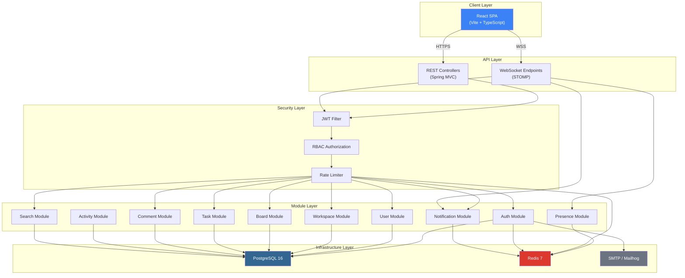
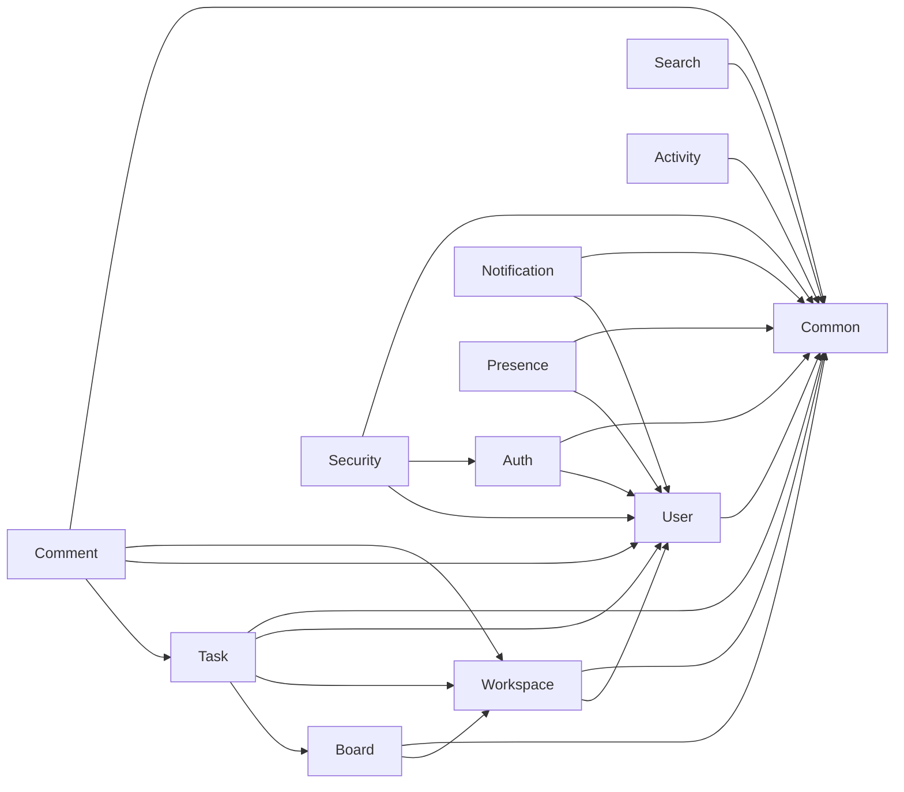
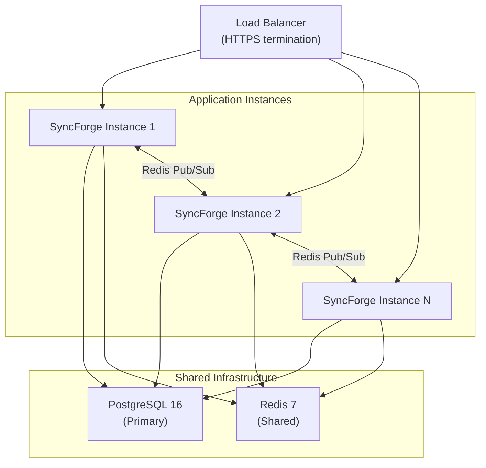
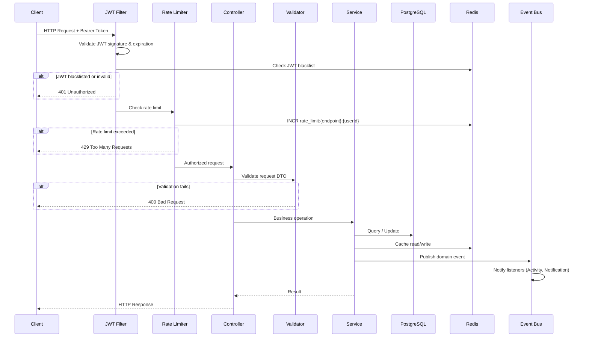

# SyncForge — Architecture Overview

## Architecture Style

SyncForge is implemented as a **Modular Monolith** using **Package-by-Feature** organization with **Clean Architecture** principles applied within each module.

### Why Modular Monolith?

| Criterion | Modular Monolith | Microservices |
|---|---|---|
| Development speed | Fast — single codebase | Slow — distributed development |
| Operational complexity | Low — single deployment | High — orchestration, networking |
| Data consistency | Strong — shared database transactions | Eventual — distributed transactions |
| Debugging | Simple — single process | Complex — distributed tracing |
| Team size fit | 1 developer | Multiple teams |
| Future extraction | Supported via module boundaries | Already extracted |

**Decision**: A Modular Monolith provides all the architectural benefits of modularity (clear boundaries, independent testing, low coupling) without the operational overhead of microservices. The module boundaries are designed so that future extraction into microservices requires minimal redesign.

### Why Package-by-Feature (not Package-by-Layer)?

**Package-by-Layer** (grouping all controllers together, all services together, etc.) creates high coupling between unrelated features and makes it difficult to reason about module boundaries.

**Package-by-Feature** (grouping all code for a feature together) provides:
- High cohesion within each module
- Clear ownership boundaries
- Independent development and testing
- Natural microservice extraction boundaries

```
com.syncforge.module.task/
├── TaskController.java        # Controller layer
├── TaskService.java           # Service interface
├── TaskServiceImpl.java       # Business logic
├── TaskRepository.java        # Data access
├── Task.java                  # Entity
├── TaskDto.java               # DTOs
├── TaskMapper.java            # Mapping
├── TaskValidator.java         # Validation
├── TaskEventPublisher.java    # Events
├── TaskException.java         # Exceptions
└── TaskConfig.java            # Configuration
```

### Clean Architecture Within Modules

Each module follows inward dependency flow:

```
Controller (HTTP) → Service (Business Logic) → Repository (Data Access)
                           ↓
                     Domain Events (Cross-module communication)
```

**Rules**:
- Controllers handle HTTP concerns only (request parsing, response formatting)
- Services contain all business logic
- Repositories handle data access only
- DTOs are used at controller boundaries; entities are internal to modules
- Domain events decouple cross-module communication

### Why NOT Hexagonal Architecture?

Formal Hexagonal Architecture (ports and adapters) introduces interface abstractions for every external dependency. For a project of this size with a single developer:
- The abstraction overhead does not provide measurable benefit
- Spring's built-in abstractions (JpaRepository, RestTemplate) already serve as ports
- Adding formal port interfaces doubles the number of files without improving testability (Mockito can mock concrete classes)

**Decision**: Apply Clean Architecture principles (dependency inversion, layer separation) without formal Hexagonal port/adapter interfaces.

---

## High-Level Architecture



---

## Package Structure

```
com.syncforge/
├── SyncForgeApplication.java          # Application entry point
│
├── module/
│   ├── auth/                          # Authentication module
│   │   ├── controller/
│   │   ├── service/
│   │   ├── repository/
│   │   ├── domain/
│   │   ├── dto/
│   │   ├── mapper/
│   │   ├── event/
│   │   ├── exception/
│   │   └── config/
│   │
│   ├── user/                          # User management module
│   ├── workspace/                     # Workspace module
│   ├── board/                         # Board module
│   ├── task/                          # Task module
│   ├── comment/                       # Comment module
│   ├── notification/                  # Notification module
│   ├── presence/                      # Presence module
│   ├── search/                        # Search module
│   └── activity/                      # Activity module
│
├── common/                            # Shared infrastructure (NOT business logic)
│   ├── exception/
│   ├── response/
│   ├── validation/
│   ├── util/
│   └── constant/
│
├── security/                          # Security infrastructure
│   ├── jwt/
│   ├── filter/
│   ├── provider/
│   └── config/
│
└── config/                            # Application configuration
    ├── RedisConfig.java
    ├── JacksonConfig.java
    ├── WebSocketConfig.java
    ├── AsyncConfig.java
    ├── OpenApiConfig.java
    └── WebConfig.java
```

---

## Module Dependency Matrix

### Allowed Dependencies



### Dependency Rules

| Module | Allowed Dependencies | Forbidden Dependencies | Justification |
|---|---|---|---|
| **Auth** | User, Common | Workspace, Board, Task, Comment, Notification | Auth is a foundational module; must not depend on business features |
| **User** | Common | Auth, Workspace, Board, Task, Comment | User is a stable module; business modules depend on it, not the reverse |
| **Workspace** | User, Common | Auth, Board, Task, Comment | Workspace owns membership; boards/tasks depend on workspace |
| **Board** | Workspace, Common | Auth, User (direct), Task, Comment | Board belongs to a workspace; user resolution goes through workspace membership |
| **Task** | Board, Workspace, User, Common | Auth, Comment | Task is a leaf module; comments depend on tasks |
| **Comment** | Task, User, Workspace, Common | Auth, Board (direct) | Comment belongs to a task; board context comes through task |
| **Notification** | User, Common | All business modules | Notification reacts to events only; never invokes business services directly |
| **Presence** | User, Common | All business modules | Presence is infrastructure; no business dependencies |
| **Search** | Common | All business modules | Search queries the database directly; no service dependencies |
| **Activity** | Common | All business modules | Activity consumes events; never invokes business services |
| **Common** | None | All modules | Common is the most stable module; zero dependencies |
| **Security** | User, Auth, Common | Business modules | Security needs user/auth for principal resolution |

### Cross-Module Communication

Modules communicate through two mechanisms:

1. **Direct service invocation** (within allowed dependencies): Module A calls Module B's public service interface
2. **Domain events** (for decoupled communication): Module A publishes an event; Module B listens and reacts

**Rule**: If Module A is not allowed to depend on Module B, but needs to trigger behavior in Module B, use domain events.

**Example**: When a Task is created, the Notification module needs to notify assignees. Task → (publishes `TaskCreated` event) → Notification (listens and creates notifications). Task never imports Notification.

---

## Distributed System Readiness

### Deployment Model



### Stateless Design Principles

| Concern | Strategy |
|---|---|
| **Session state** | No server-side sessions; JWT carries authentication state |
| **WebSocket state** | Connection state is per-instance; Redis Pub/Sub synchronizes events across instances |
| **Presence** | Redis is the source of truth for presence data; any instance can read/write |
| **Rate limiting** | Redis-backed counters; shared across all instances |
| **Caching** | Redis-backed caches; shared across all instances |
| **JWT blacklist** | Redis-backed blacklist; shared across all instances |
| **File storage** | None (Gravatar for avatars) |

### Multi-Instance Concerns

| Subsystem | Single Instance | Multi-Instance Solution |
|---|---|---|
| WebSocket broadcast | Local `SimpMessagingTemplate` | Redis Pub/Sub relay — publish to Redis channel, all instances receive and broadcast locally |
| Presence heartbeats | In-memory tracking | Redis `SETEX` with TTL — any instance can update, expiration is automatic |
| Domain events | Spring `ApplicationEventPublisher` (in-process) | Events remain in-process. WebSocket broadcasts resulting from events use Redis Pub/Sub |
| Refresh token rotation | Database atomicity | `UPDATE ... WHERE token = ? AND used = false` — atomic database operation |
| Rate limiting | Redis `INCR` with `EXPIRE` | Same — Redis is already shared |
| Scheduled jobs | `@Scheduled` on every instance | Use `ShedLock` or Redis-based distributed lock to ensure only one instance runs cleanup jobs |

### Graceful Shutdown

1. Stop accepting new HTTP connections
2. Stop accepting new WebSocket connections
3. Wait for in-flight requests to complete (30-second timeout)
4. Publish disconnect events for all active WebSocket sessions
5. Update presence in Redis (mark sessions from this instance as offline)
6. Close database connection pool
7. Close Redis connection pool
8. Exit

---

## Request Lifecycle



---

## Key Architectural Properties

### High Cohesion
Each module encapsulates all code related to a single business capability. A developer working on Tasks touches only the `task/` package.

### Low Coupling
Modules interact through narrow public service interfaces and asynchronous domain events. No module directly accesses another module's repository or entity.

### Independent Persistence
Each module owns its database tables. The `task` module owns the `tasks` and `task_labels` tables. No other module may write to these tables.

### Independent Validation
Each module validates its own inputs. The `task` module validates task DTOs; it does not rely on the `board` module to validate board membership (though it may call the workspace module to verify workspace access).

### Independent Testing
Each module can be unit-tested in isolation by mocking its dependencies. Integration tests use Testcontainers with real PostgreSQL and Redis.

### Microservice Extraction Path
If future scale demands it, any module can be extracted into a microservice by:
1. Replacing direct service calls with REST/gRPC calls
2. Replacing Spring Application Events with a message broker (Kafka/RabbitMQ)
3. Giving the module its own database
4. Deploying independently

This extraction is explicitly NOT planned for the initial implementation.
