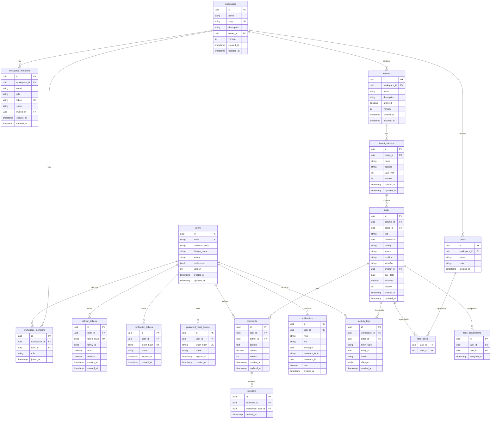

# SyncForge — Domain Model

## Domain Overview

SyncForge's domain is organized around the following hierarchy:

```
Workspace
└── Board
    └── Column
        └── Task
            ├── Label (many-to-many)
            ├── Comment
            │   └── Mention
            └── Activity
```

Supporting domains (independent of the core hierarchy):
- **Authentication** — registration, login, tokens
- **User** — profiles, preferences
- **Notification** — in-app notifications
- **Presence** — online status tracking
- **Search** — full-text search
- **Activity** — audit trail

---

## Entity Relationship Diagram



---

## Core Entities

### User

| Attribute | Type | Constraints | Description |
|---|---|---|---|
| `id` | UUID | PK | Unique identifier |
| `email` | VARCHAR(255) | UNIQUE, NOT NULL | Login email |
| `password_hash` | VARCHAR(255) | NOT NULL | BCrypt hash |
| `display_name` | VARCHAR(100) | NOT NULL | Display name |
| `status` | VARCHAR(20) | NOT NULL | Account status: `PENDING`, `ACTIVE`, `SUSPENDED`, `DEACTIVATED` |
| `preferences` | JSONB | DEFAULT '{}' | User preferences (theme, notifications, locale) |
| `version` | INTEGER | NOT NULL, DEFAULT 0 | Optimistic locking |
| `created_at` | TIMESTAMP | NOT NULL | Creation timestamp |
| `updated_at` | TIMESTAMP | NOT NULL | Last update timestamp |

**Avatar**: Computed from email via Gravatar. Not stored in the database. URL pattern: `https://www.gravatar.com/avatar/{md5(email.lowercase().trim())}?s=200&d=identicon`

**Preferences JSONB structure**:
```json
{
  "theme": "dark",
  "emailNotifications": true,
  "timezone": "UTC",
  "locale": "en"
}
```

---

### Workspace

| Attribute | Type | Constraints | Description |
|---|---|---|---|
| `id` | UUID | PK | Unique identifier |
| `name` | VARCHAR(100) | NOT NULL | Workspace name |
| `slug` | VARCHAR(100) | UNIQUE, NOT NULL | URL-friendly identifier |
| `description` | VARCHAR(500) | NULLABLE | Optional description |
| `owner_id` | UUID | FK → users, NOT NULL | Workspace owner |
| `version` | INTEGER | NOT NULL, DEFAULT 0 | Optimistic locking |
| `created_at` | TIMESTAMP | NOT NULL | Creation timestamp |
| `updated_at` | TIMESTAMP | NOT NULL | Last update timestamp |

**Slug generation**: Auto-generated from workspace name via `toLowerCase().replaceAll("[^a-z0-9]+", "-")`. Uniqueness enforced at the database level.

---

### Workspace Member

| Attribute | Type | Constraints | Description |
|---|---|---|---|
| `id` | UUID | PK | Unique identifier |
| `workspace_id` | UUID | FK → workspaces, NOT NULL | Parent workspace |
| `user_id` | UUID | FK → users, NOT NULL | Member user |
| `role` | VARCHAR(20) | NOT NULL | `OWNER`, `ADMIN`, `MEMBER`, `VIEWER` |
| `joined_at` | TIMESTAMP | NOT NULL | Join timestamp |

**Unique constraint**: `(workspace_id, user_id)` — a user can have exactly one role per workspace.

---

### Workspace Invitation

| Attribute | Type | Constraints | Description |
|---|---|---|---|
| `id` | UUID | PK | Unique identifier |
| `workspace_id` | UUID | FK → workspaces, NOT NULL | Target workspace |
| `email` | VARCHAR(255) | NOT NULL | Invitee email |
| `role` | VARCHAR(20) | NOT NULL, DEFAULT 'MEMBER' | Assigned role on acceptance |
| `token` | VARCHAR(255) | UNIQUE, NOT NULL | Secure invitation token (hashed) |
| `status` | VARCHAR(20) | NOT NULL | `PENDING`, `ACCEPTED`, `EXPIRED`, `REVOKED` |
| `invited_by` | UUID | FK → users, NOT NULL | Inviter |
| `expires_at` | TIMESTAMP | NOT NULL | Expiration time (7 days) |
| `created_at` | TIMESTAMP | NOT NULL | Creation timestamp |

**Unique constraint**: `(workspace_id, email, status)` where status = `PENDING` — only one pending invitation per email per workspace.

---

### Board

| Attribute | Type | Constraints | Description |
|---|---|---|---|
| `id` | UUID | PK | Unique identifier |
| `workspace_id` | UUID | FK → workspaces, NOT NULL | Parent workspace |
| `name` | VARCHAR(100) | NOT NULL | Board name |
| `description` | VARCHAR(500) | NULLABLE | Optional description |
| `archived` | BOOLEAN | NOT NULL, DEFAULT false | Archive status |
| `version` | INTEGER | NOT NULL, DEFAULT 0 | Optimistic locking |
| `created_at` | TIMESTAMP | NOT NULL | Creation timestamp |
| `updated_at` | TIMESTAMP | NOT NULL | Last update timestamp |

---

### Board Column

| Attribute | Type | Constraints | Description |
|---|---|---|---|
| `id` | UUID | PK | Unique identifier |
| `board_id` | UUID | FK → boards, NOT NULL | Parent board |
| `name` | VARCHAR(100) | NOT NULL | Column name |
| `position` | VARCHAR(255) | NOT NULL | Fractional index for ordering |
| `task_limit` | INTEGER | NULLABLE | Optional WIP limit |
| `version` | INTEGER | NOT NULL, DEFAULT 0 | Optimistic locking |
| `created_at` | TIMESTAMP | NOT NULL | Creation timestamp |
| `updated_at` | TIMESTAMP | NOT NULL | Last update timestamp |

---

### Task

| Attribute | Type | Constraints | Description |
|---|---|---|---|
| `id` | UUID | PK | Unique identifier |
| `column_id` | UUID | FK → board_columns, NOT NULL | Parent column |
| `board_id` | UUID | FK → boards, NOT NULL | Parent board (denormalized for query performance) |
| `title` | VARCHAR(255) | NOT NULL | Task title |
| `description` | TEXT | NULLABLE | Rich text description |
| `priority` | VARCHAR(20) | NOT NULL, DEFAULT 'NONE' | `URGENT`, `HIGH`, `MEDIUM`, `LOW`, `NONE` |
| `status` | VARCHAR(20) | NOT NULL, DEFAULT 'OPEN' | `OPEN`, `IN_PROGRESS`, `DONE`, `ARCHIVED` |
| `position` | VARCHAR(255) | NOT NULL | Fractional index for ordering within column |
| `identifier` | VARCHAR(20) | NOT NULL | Human-readable ID (e.g., `SF-123`) |
| `creator_id` | UUID | FK → users, NOT NULL | Task creator |
| `due_date` | DATE | NULLABLE | Optional due date |
| `archived` | BOOLEAN | NOT NULL, DEFAULT false | Archive status |
| `version` | INTEGER | NOT NULL, DEFAULT 0 | Optimistic locking |
| `created_at` | TIMESTAMP | NOT NULL | Creation timestamp |
| `updated_at` | TIMESTAMP | NOT NULL | Last update timestamp |

**`board_id` denormalization**: Stored directly on the task (instead of requiring a join through `board_columns`) because board-level queries (load all tasks for a board) are the most common read pattern. The column already references the board, but this avoids a join on every board load.

**`identifier` generation**: Auto-generated sequential identifier per board. Format: `{BOARD_PREFIX}-{SEQUENCE}`. The board prefix is derived from the board name (first 2-3 uppercase letters). Sequence is maintained via a `board_task_sequence` counter on the `boards` table.

**Search vector**: A `tsvector` column `search_vector` is maintained via trigger for full-text search across `title` and `description`.

---

### Task Assignment

| Attribute | Type | Constraints | Description |
|---|---|---|---|
| `id` | UUID | PK | Unique identifier |
| `task_id` | UUID | FK → tasks, NOT NULL | Assigned task |
| `user_id` | UUID | FK → users, NOT NULL | Assigned user |
| `assigned_at` | TIMESTAMP | NOT NULL | Assignment timestamp |

**Unique constraint**: `(task_id, user_id)` — a user can be assigned to a task at most once.

---

### Label

| Attribute | Type | Constraints | Description |
|---|---|---|---|
| `id` | UUID | PK | Unique identifier |
| `workspace_id` | UUID | FK → workspaces, NOT NULL | Parent workspace |
| `name` | VARCHAR(50) | NOT NULL | Label name |
| `color` | VARCHAR(7) | NOT NULL | Hex color code |
| `created_at` | TIMESTAMP | NOT NULL | Creation timestamp |

**Unique constraint**: `(workspace_id, name)` — label names are unique within a workspace.

**Scope**: Labels are workspace-scoped (not board-scoped). This allows consistent labeling across boards within a workspace, matching how Linear and GitHub handle labels.

---

### Task Label (Join Table)

| Attribute | Type | Constraints | Description |
|---|---|---|---|
| `task_id` | UUID | FK → tasks, NOT NULL | Tagged task |
| `label_id` | UUID | FK → labels, NOT NULL | Applied label |

**Composite PK**: `(task_id, label_id)`

---

### Comment

| Attribute | Type | Constraints | Description |
|---|---|---|---|
| `id` | UUID | PK | Unique identifier |
| `task_id` | UUID | FK → tasks, NOT NULL | Parent task |
| `author_id` | UUID | FK → users, NOT NULL | Comment author |
| `content` | TEXT | NOT NULL | Comment text (with @mentions) |
| `deleted` | BOOLEAN | NOT NULL, DEFAULT false | Soft delete flag |
| `version` | INTEGER | NOT NULL, DEFAULT 0 | Optimistic locking |
| `created_at` | TIMESTAMP | NOT NULL | Creation timestamp |
| `updated_at` | TIMESTAMP | NOT NULL | Last update timestamp |

**Soft delete**: Deleted comments show as "This comment has been deleted" rather than disappearing, preserving conversation context.

---

### Mention

| Attribute | Type | Constraints | Description |
|---|---|---|---|
| `id` | UUID | PK | Unique identifier |
| `comment_id` | UUID | FK → comments, NOT NULL | Source comment |
| `mentioned_user_id` | UUID | FK → users, NOT NULL | Mentioned user |
| `created_at` | TIMESTAMP | NOT NULL | Creation timestamp |

**Parsing**: Mentions are extracted from comment text using the pattern `@{display_name}`. The server resolves display names to user IDs during comment creation.

---

### Notification

| Attribute | Type | Constraints | Description |
|---|---|---|---|
| `id` | UUID | PK | Unique identifier |
| `user_id` | UUID | FK → users, NOT NULL | Recipient |
| `type` | VARCHAR(50) | NOT NULL | Notification type (see below) |
| `title` | VARCHAR(255) | NOT NULL | Short title |
| `message` | TEXT | NULLABLE | Detailed message |
| `reference_type` | VARCHAR(50) | NULLABLE | Entity type (TASK, COMMENT, WORKSPACE, etc.) |
| `reference_id` | UUID | NULLABLE | Entity ID for navigation |
| `read` | BOOLEAN | NOT NULL, DEFAULT false | Read status |
| `created_at` | TIMESTAMP | NOT NULL | Creation timestamp |

**Notification types**: `TASK_ASSIGNED`, `TASK_UPDATED`, `COMMENT_ADDED`, `MENTION`, `INVITATION_RECEIVED`, `MEMBER_JOINED`, `WORKSPACE_UPDATE`

---

### Activity Log

| Attribute | Type | Constraints | Description |
|---|---|---|---|
| `id` | UUID | PK | Unique identifier |
| `workspace_id` | UUID | FK → workspaces, NOT NULL | Context workspace |
| `actor_id` | UUID | FK → users, NOT NULL | Who performed the action |
| `entity_type` | VARCHAR(50) | NOT NULL | `TASK`, `BOARD`, `COLUMN`, `COMMENT`, `WORKSPACE`, `MEMBER` |
| `entity_id` | UUID | NOT NULL | Target entity |
| `action` | VARCHAR(50) | NOT NULL | Action performed (see below) |
| `changes` | JSONB | NULLABLE | Structured change data |
| `created_at` | TIMESTAMP | NOT NULL | Action timestamp |

**Actions**: `CREATED`, `UPDATED`, `DELETED`, `ARCHIVED`, `MOVED`, `ASSIGNED`, `UNASSIGNED`, `LABEL_ADDED`, `LABEL_REMOVED`, `COMMENTED`, `STATUS_CHANGED`, `PRIORITY_CHANGED`

**Changes JSONB structure**:
```json
{
  "field": "priority",
  "from": "LOW",
  "to": "HIGH"
}
```

---

### Refresh Token

| Attribute | Type | Constraints | Description |
|---|---|---|---|
| `id` | UUID | PK | Unique identifier |
| `user_id` | UUID | FK → users, NOT NULL | Token owner |
| `token_hash` | VARCHAR(255) | UNIQUE, NOT NULL | SHA-256 hash of the token |
| `family_id` | VARCHAR(255) | NOT NULL | Token family for rotation detection |
| `used` | BOOLEAN | NOT NULL, DEFAULT false | Whether this token has been used |
| `revoked` | BOOLEAN | NOT NULL, DEFAULT false | Whether this token has been revoked |
| `expires_at` | TIMESTAMP | NOT NULL | Expiration time |
| `created_at` | TIMESTAMP | NOT NULL | Creation timestamp |

---

### Verification Token

| Attribute | Type | Constraints | Description |
|---|---|---|---|
| `id` | UUID | PK | Unique identifier |
| `user_id` | UUID | FK → users, NOT NULL | Token owner |
| `token_hash` | VARCHAR(255) | UNIQUE, NOT NULL | SHA-256 hash of the token |
| `status` | VARCHAR(20) | NOT NULL | `PENDING`, `USED`, `EXPIRED` |
| `expires_at` | TIMESTAMP | NOT NULL | Expiration (24 hours) |
| `created_at` | TIMESTAMP | NOT NULL | Creation timestamp |

---

### Password Reset Token

| Attribute | Type | Constraints | Description |
|---|---|---|---|
| `id` | UUID | PK | Unique identifier |
| `user_id` | UUID | FK → users, NOT NULL | Token owner |
| `token_hash` | VARCHAR(255) | UNIQUE, NOT NULL | SHA-256 hash of the token |
| `status` | VARCHAR(20) | NOT NULL | `PENDING`, `USED`, `EXPIRED` |
| `expires_at` | TIMESTAMP | NOT NULL | Expiration (1 hour) |
| `created_at` | TIMESTAMP | NOT NULL | Creation timestamp |

---

## Relationship Summary

| Relationship | Type | Delete Behavior |
|---|---|---|
| User → Workspace Members | One-to-Many | CASCADE (user deletion removes memberships) |
| User → Refresh Tokens | One-to-Many | CASCADE |
| User → Verification Tokens | One-to-Many | CASCADE |
| User → Password Reset Tokens | One-to-Many | CASCADE |
| User → Comments | One-to-Many | SET NULL on author_id (preserve comments) |
| User → Notifications | One-to-Many | CASCADE |
| Workspace → Workspace Members | One-to-Many | CASCADE |
| Workspace → Workspace Invitations | One-to-Many | CASCADE |
| Workspace → Boards | One-to-Many | CASCADE |
| Workspace → Labels | One-to-Many | CASCADE |
| Board → Board Columns | One-to-Many | CASCADE |
| Board Column → Tasks | One-to-Many | RESTRICT (cannot delete column with tasks) |
| Task → Comments | One-to-Many | CASCADE |
| Task → Task Labels | One-to-Many | CASCADE |
| Task → Task Assignments | One-to-Many | CASCADE |
| Task → Activity Logs | One-to-Many | CASCADE |
| Comment → Mentions | One-to-Many | CASCADE |
| Label → Task Labels | One-to-Many | CASCADE |

---

## ID Strategy

All entities use **UUID v7** as primary keys.

**Why UUID v7?**
- UUID v7 is time-ordered (monotonically increasing), providing better B-tree index performance than UUID v4
- No central sequence coordination needed (supports distributed generation)
- Unpredictable enough to prevent enumeration attacks
- 128-bit — no collision risk at these capacity targets

**Implementation**: Use Java's `UUID.randomUUID()` with a UUID v7 generator utility, or use the `uuid-creator` library with `UuidCreator.getTimeOrderedEpoch()`.

---

## Audit Fields

All mutable entities include:
- `created_at` — set once at creation, never updated
- `updated_at` — updated on every modification

Both are `TIMESTAMP WITH TIME ZONE` stored in UTC.

**Implementation**: Use JPA `@PrePersist` and `@PreUpdate` callbacks via a `@MappedSuperclass` base entity.

```java
@MappedSuperclass
public abstract class BaseEntity {
    @Column(name = "created_at", nullable = false, updatable = false)
    private Instant createdAt;

    @Column(name = "updated_at", nullable = false)
    private Instant updatedAt;

    @PrePersist
    protected void onCreate() {
        this.createdAt = Instant.now();
        this.updatedAt = Instant.now();
    }

    @PreUpdate
    protected void onUpdate() {
        this.updatedAt = Instant.now();
    }
}
```

---

## Task Identifier System

Each task receives a human-readable identifier (e.g., `SF-123`) that is unique within a board.

**Implementation**:
1. Each board maintains a `task_sequence` counter (INTEGER, default 0)
2. When a task is created, the board's sequence is atomically incremented
3. The task identifier is formed as `{board_prefix}-{sequence}`
4. Board prefix is derived from the board name (first 2-3 uppercase characters)

**Uniqueness**: Enforced by `UNIQUE(board_id, identifier)` constraint.

**Query**: `SELECT * FROM tasks WHERE board_id = ? AND identifier = ?`

This approach is simpler than a global sequence and provides board-scoped identifiers similar to GitHub Issues or Linear's issue IDs.
