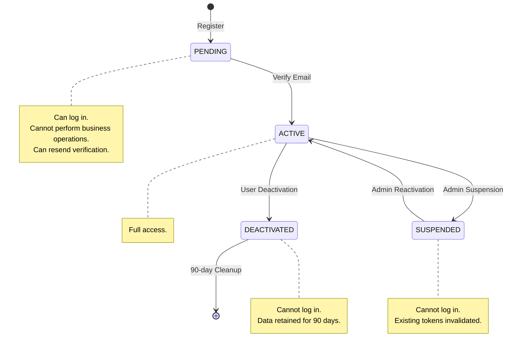
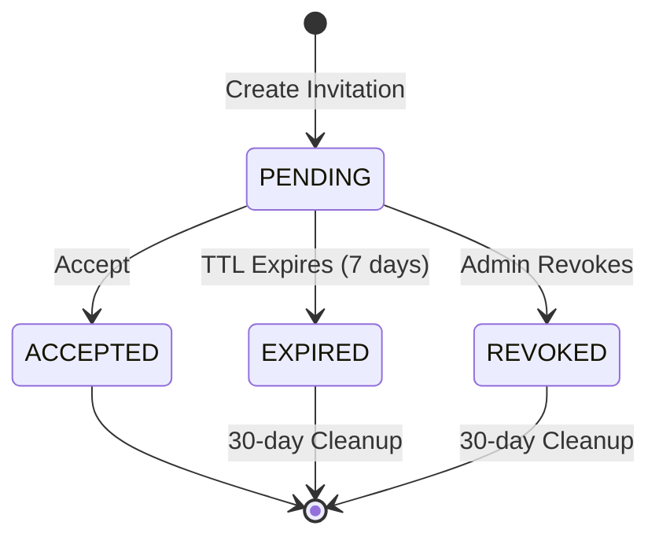
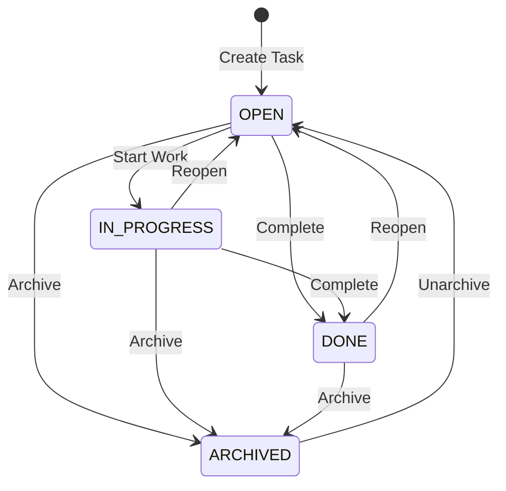
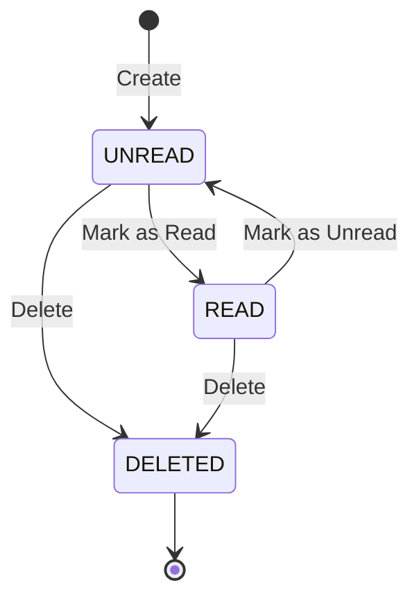
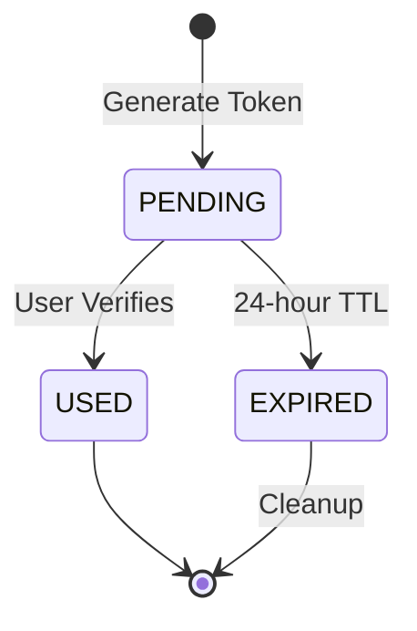
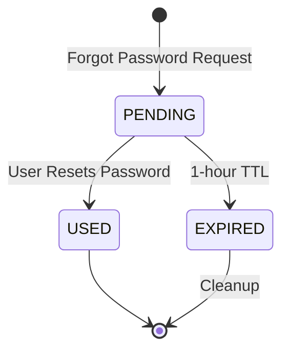
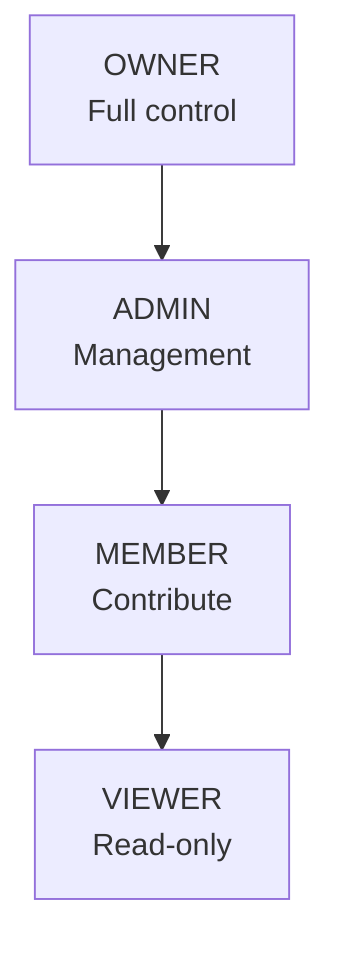

# SyncForge — Business Rules & State Machines

## User Business Rules

### Registration
- Email must be unique (case-insensitive comparison via `LOWER(email)`)
- Email must be valid format (RFC 5322)
- Display name: 2–100 characters, no leading/trailing whitespace
- Password requirements:
  - Minimum 8 characters
  - At least 1 uppercase letter
  - At least 1 lowercase letter
  - At least 1 digit
  - At least 1 special character (`!@#$%^&*()_+-=[]{}|;:,.<>?`)
  - Maximum 128 characters
- New accounts start in `PENDING` status
- Account becomes `ACTIVE` only after email verification
- `PENDING` accounts cannot log in or access any API endpoints until verified

### Account Status
- Only `ACTIVE` users can perform business operations (create workspaces, join, etc.)
- `PENDING` users cannot access the workspace application; they must first verify their email and activate their account
- `SUSPENDED` users cannot log in; existing sessions are invalidated
- `DEACTIVATED` users cannot log in; data is retained for 90 days before permanent deletion

### Profile Updates
- Display name can be changed at any time
- Email change is not supported in MVP (future enhancement)
- Preferences are stored as JSONB; partial updates are supported

---

## Workspace Business Rules

### Creation
- Workspace name: 2–100 characters
- Slug: auto-generated from name; unique across all workspaces
- Slug format: lowercase alphanumeric with hyphens, 2–100 characters
- If slug already exists, append numeric suffix (`my-workspace`, `my-workspace-2`, `my-workspace-3`)
- Creator automatically becomes OWNER and first member
- Maximum 10 workspaces per user (as owner)

### Membership
- A user can be a member of up to 20 workspaces
- A workspace can have up to 50 members
- Each user has exactly one role per workspace
- Role hierarchy: OWNER > ADMIN > MEMBER > VIEWER

### Ownership
- Every workspace must have exactly one OWNER
- OWNER cannot leave without transferring ownership to another ADMIN or MEMBER
- OWNER can transfer ownership to any workspace member
- After transfer, the former owner becomes ADMIN

### Deletion
- Only OWNER can delete a workspace
- Deletion is a hard operation: workspace is deleted immediately
- All members, boards, columns, tasks, comments, and activity within the workspace are cascade-deleted via database foreign keys
- Deleted workspaces are permanently and immediately removed

### Slug Rules
- Generated from workspace name: `name.toLowerCase().replaceAll("[^a-z0-9]+", "-").replaceAll("^-|-$", "")`
- Minimum 2 characters after sanitization
- Uniqueness enforced at database level

---

## Invitation Business Rules

### Creation
- Only ADMIN+ can create invitations
- Cannot invite existing workspace members
- Cannot invite if a PENDING invitation already exists for that email in that workspace
- Invited role cannot exceed the inviter's role (ADMIN cannot invite as OWNER)
- Default invited role: MEMBER
- Invitation expires after 7 days
- Maximum 20 pending invitations per workspace

### Acceptance
- Only the user whose email matches the invitation can accept
- The accepting user must have an ACTIVE account
- Acceptance creates a workspace membership with the invited role
- Invitation status transitions to ACCEPTED
- If user doesn't have an account, they must register first (invitation remains valid)

### Revocation
- ADMIN+ can revoke pending invitations
- Revoked invitations cannot be accepted

### Expiration
- Expired invitations cannot be accepted
- A cleanup job marks expired invitations (runs daily)
- Expired invitations are permanently deleted after 30 days

---

## Board Business Rules

### Creation
- Board name: 2–100 characters
- Board belongs to exactly one workspace
- Only MEMBER+ can create boards
- Three default columns are created: "To Do", "In Progress", "Done"
- Board prefix for task identifiers: first 2–3 uppercase letters of board name
- If prefix conflicts with another board in the same workspace, append a digit

### Archiving
- ADMIN+ can archive boards
- Archived boards are read-only (no new tasks, no updates)
- Archived boards can be unarchived by ADMIN+
- Archived boards are still visible in board lists (filtered by default)

### Deletion
- ADMIN+ can delete boards
- Boards can only be deleted if they have no tasks (or all tasks are archived)
- This prevents accidental data loss

### Column Rules
- Minimum 1 column per board (cannot delete the last column)
- Maximum 12 columns per board
- Column name: 2–100 characters
- Columns are ordered using fractional indexing
- Column cannot be deleted if it contains non-archived tasks (move tasks first)
- Optional WIP (Work In Progress) limit: if set, UI warns (but does not prevent) when limit is exceeded

---

## Task Business Rules

### Creation
- Title: 2–255 characters (required)
- Description: optional, up to 10,000 characters
- Priority: `URGENT`, `HIGH`, `MEDIUM`, `LOW`, `NONE` (default: `NONE`)
- Status: automatically set based on column (configurable, default: `OPEN`)
- Task is assigned a sequential identifier within the board (e.g., `SF-1`, `SF-2`)
- Creator is recorded but not automatically assigned
- Position is set to the end of the target column

### Updates
- MEMBER+ can update any task in their workspace
- All field changes are recorded in the activity log
- Optimistic locking prevents concurrent update conflicts
- `updated_at` is always set on update

### Assignment
- A task can have up to 5 assignees
- MEMBER+ can assign/unassign
- Assigning a user creates a `TASK_ASSIGNED` notification
- Unassigning a user does not create a notification

### Labels
- A task can have up to 10 labels
- Labels are workspace-scoped (shared across boards)
- Maximum 50 labels per workspace
- Adding/removing labels is recorded in the activity log

### Movement
- Tasks can be moved between columns within the same board
- Tasks can be moved between boards within the same workspace (future enhancement — not MVP)
- Movement updates `column_id` and `position`
- Movement is recorded in the activity log as a `MOVED` action

### Archiving
- Creator or ADMIN+ can archive tasks
- Archived tasks are hidden from board view by default
- Archived tasks are read-only
- Archived tasks can be unarchived

### Task Identifier
- Format: `{BOARD_PREFIX}-{SEQUENCE}`
- Sequence is monotonically increasing per board, never reused
- Identifier is immutable once assigned

---

## Comment Business Rules

### Creation
- MEMBER+ can create comments on non-archived tasks
- Comment content: 1–5,000 characters (required)
- Mentions are parsed from content using `@{displayName}` pattern
- Each mention creates a Mention record and triggers a notification
- Comment creation is recorded in the activity log

### Editing
- Only the comment author can edit
- Edit window: **15 minutes** from creation
- After the edit window, comments are immutable
- `updated_at` is set on edit
- Edit history is not tracked in MVP (future enhancement)

### Deletion
- **Author**: can soft-delete own comments at any time
- **ADMIN+**: can soft-delete any comment
- Soft-deleted comments display as "This comment has been deleted"
- Soft-deleted comments retain their position in the conversation thread
- Hard deletion is never performed (preserves conversation context)

### Mention Parsing
- Pattern: `@DisplayName` (space-delimited or end of content)
- Resolution: display name is matched against workspace members (case-insensitive)
- Unresolvable mentions are ignored (no error, rendered as plain text)
- A user is mentioned at most once per comment (duplicates are deduplicated)
- Self-mentions are ignored (no notification to the author)

---

## Notification Business Rules

### Creation
- Notifications are created by event consumers, never by direct API calls
- Each notification has a single recipient
- Notifications include a reference (type + ID) for navigation

### Read/Unread
- New notifications are unread by default
- Users can mark individual notifications as read
- Users can mark all notifications as read (bulk operation)
- Read status is per-user (each user has their own notification state)

### Retention
- Notifications are retained for 90 days
- A daily cleanup job deletes notifications older than 90 days
- Users can manually delete individual notifications

### Delivery
- Notifications are persisted to the database AND delivered via WebSocket in real-time
- If WebSocket delivery fails (user offline), the notification remains in the database for later retrieval
- No email notifications in MVP

### Deduplication
- The same event should not create duplicate notifications for the same user
- Example: if a user is both assigned to a task AND mentioned in a comment on that task, they receive separate notifications (different types)

---

## State Machines

### User Account Status

| Transition | Trigger | Business Rule |
|---|---|---|
| `PENDING → ACTIVE` | Email verification | Token must be valid and unused |
| `ACTIVE → SUSPENDED` | Admin action | All refresh tokens revoked; active JWTs blacklisted |
| `ACTIVE → DEACTIVATED` | User self-service | All tokens revoked; profile hidden |
| `SUSPENDED → ACTIVE` | Admin reactivation | User can log in again |
| `DEACTIVATED → deleted` | 90-day cleanup job | Permanent data removal |

**Invalid transitions**: `PENDING → SUSPENDED`, `PENDING → DEACTIVATED`, `SUSPENDED → DEACTIVATED`, `DEACTIVATED → ACTIVE`

---

### Workspace Invitation Status

| Transition | Trigger | Business Rule |
|---|---|---|
| `PENDING → ACCEPTED` | User accepts with valid token | User's email must match; account must be ACTIVE |
| `PENDING → EXPIRED` | Cleanup job | 7 days after creation |
| `PENDING → REVOKED` | ADMIN+ revokes | Immediate |

**Terminal states**: `ACCEPTED`, `EXPIRED`, `REVOKED`

**Recovery**: If an invitation expires, the inviter can create a new invitation.

---

### Task Status

| Transition | Trigger | Business Rule |
|---|---|---|
| `OPEN → IN_PROGRESS` | Explicit status change or move to "In Progress" column | MEMBER+ |
| `OPEN → DONE` | Explicit status change or move to "Done" column | MEMBER+ |
| `* → ARCHIVED` | Archive action | Creator or ADMIN+ |
| `ARCHIVED → OPEN` | Unarchive action | ADMIN+ |
| `DONE → OPEN` | Reopen action | MEMBER+ |

**Note**: Task status can optionally be linked to column mapping (e.g., moving to "Done" column sets status to `DONE`). This is configurable per board in future enhancements. For MVP, status changes are explicit.

---

### Notification Status

| Transition | Trigger | Business Rule |
|---|---|---|
| `UNREAD → READ` | User marks as read | Owner only |
| `READ → UNREAD` | User marks as unread | Owner only |
| `* → DELETED` | User deletes or 90-day cleanup | Owner or system |

---

### Email Verification Token

| Transition | Trigger | Business Rule |
|---|---|---|
| `PENDING → USED` | User submits valid token | Single-use; user status changes to ACTIVE |
| `PENDING → EXPIRED` | 24 hours elapsed | Cleanup job |

**Recovery**: User can request a new verification email. Previous pending tokens are invalidated.

**Security**: Token is transmitted via email link. Stored as SHA-256 hash in database.

---

### Password Reset Token

| Transition | Trigger | Business Rule |
|---|---|---|
| `PENDING → USED` | User submits valid token with new password | Single-use; all existing refresh tokens revoked |
| `PENDING → EXPIRED` | 1 hour elapsed | Cleanup job |

**Recovery**: User can request a new reset email. Previous pending tokens are invalidated.

**Security**: On successful password reset, all refresh tokens for the user are revoked, forcing re-authentication on all devices.

---

## Role Hierarchy

**Inheritance**: Each role inherits all permissions of the roles below it.
- `OWNER` can do everything `ADMIN` can, plus: delete workspace, transfer ownership
- `ADMIN` can do everything `MEMBER` can, plus: manage members, manage invitations, archive/delete boards, moderate comments
- `MEMBER` can do everything `VIEWER` can, plus: create boards, create/update tasks, comment, assign
- `VIEWER` can: read all workspace data, search

**Evaluation**: `hasRole(required) → user.role.ordinal() >= required.ordinal()`
