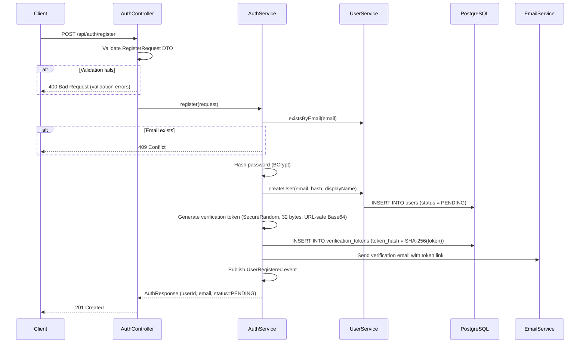
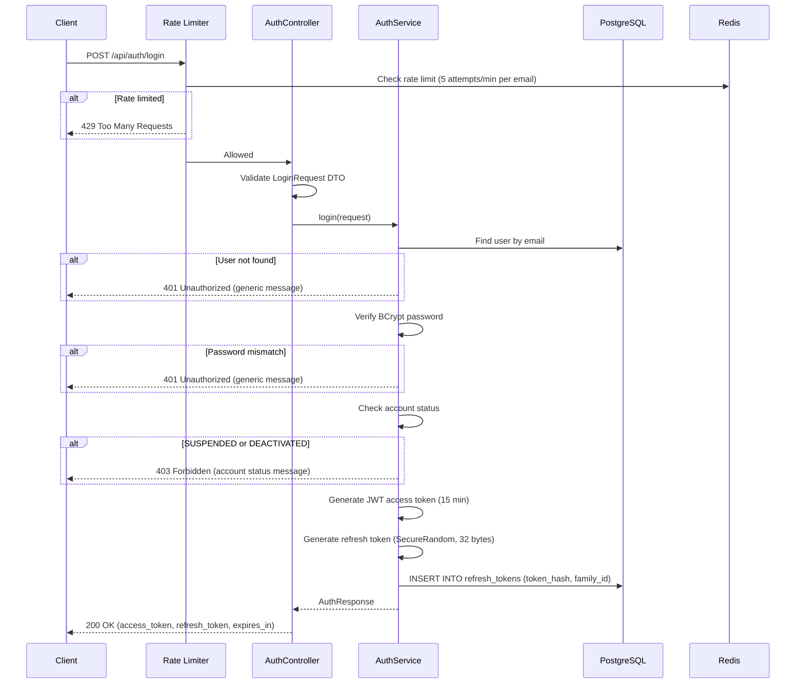
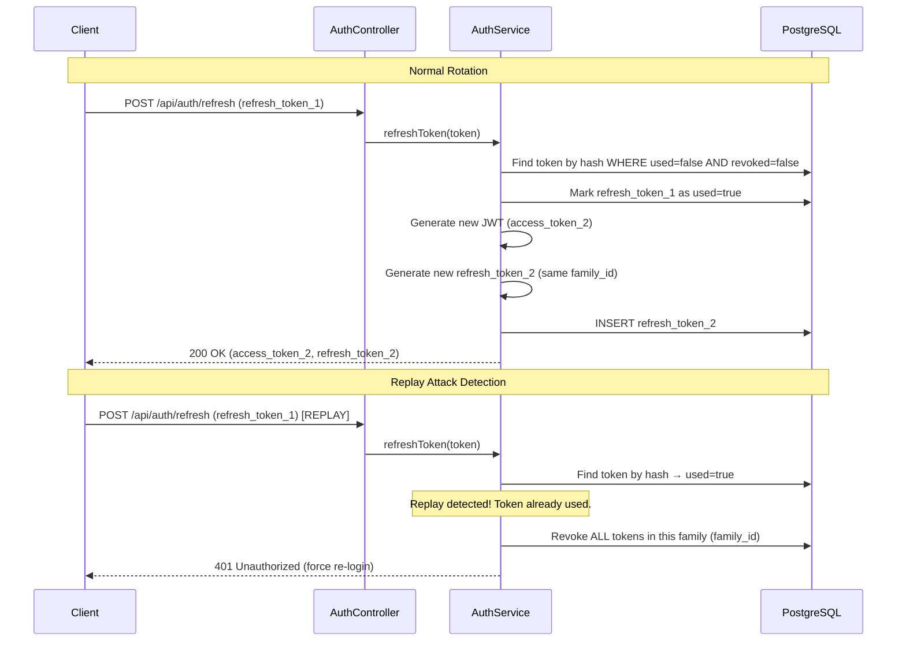
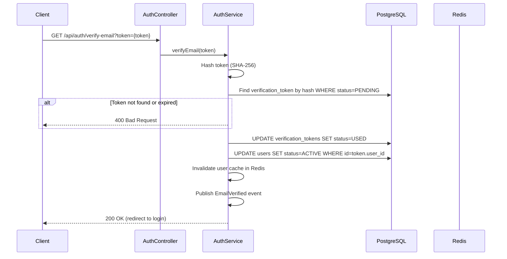
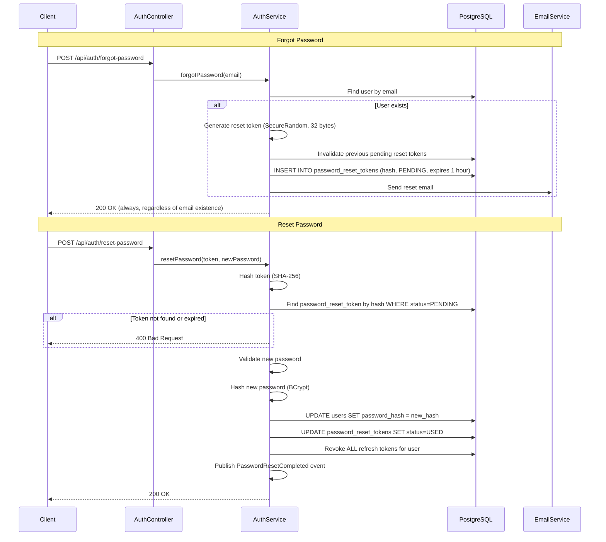
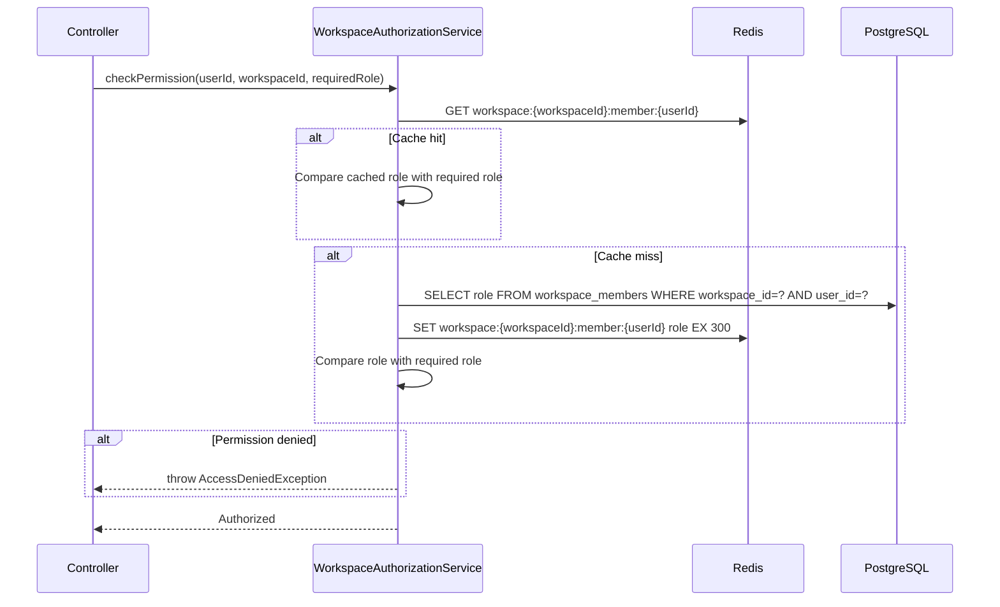

# SyncForge — Authentication & Authorization

## Authentication Architecture

SyncForge uses **stateless JWT-based authentication** with **Redis-backed refresh token rotation** and **role-based access control (RBAC)**.

### Design Principles
- Stateless APIs — no server-side sessions
- Short-lived access tokens (15 minutes)
- Long-lived refresh tokens (7 days) with rotation
- Redis-backed JWT blacklist for revocation
- BCrypt password hashing (cost factor 12)
- Rate limiting on authentication endpoints

---

## Registration Flow

### Sequence Diagram



### Registration Request

```json
{
  "email": "user@example.com",
  "password": "SecureP@ss1",
  "displayName": "John Doe"
}
```

### Registration Response

```json
{
  "userId": "uuid",
  "email": "user@example.com",
  "displayName": "John Doe",
  "status": "PENDING",
  "message": "Please check your email to verify your account."
}
```

### Transaction Boundary
- User creation + verification token creation = single transaction
- Email sending is performed after commit (best-effort)
- If email sending fails, user can request resend

### Validation
| Field | Rules |
|---|---|
| `email` | Required, valid email format, max 255 chars |
| `password` | Required, 8-128 chars, 1 upper, 1 lower, 1 digit, 1 special |
| `displayName` | Required, 2-100 chars, trimmed |

---

## Login Flow

### Sequence Diagram



### Login Request

```json
{
  "email": "user@example.com",
  "password": "SecureP@ss1"
}
```

### Login Response

```json
{
  "accessToken": "eyJhbGciOiJIUzM4NCJ9...",
  "refreshToken": "dGhpcyBpcyBhIHJlZnJlc2ggdG9rZW4...",
  "tokenType": "Bearer",
  "expiresIn": 900,
  "user": {
    "id": "uuid",
    "email": "user@example.com",
    "displayName": "John Doe",
    "status": "ACTIVE",
    "avatarUrl": "https://www.gravatar.com/avatar/..."
  }
}
```

### Security Considerations
- **Generic error messages**: Never reveal whether email exists or password is wrong — always return "Invalid credentials"
- **Rate limiting**: 5 login attempts per email per minute; 20 per IP per minute
- **Timing attacks**: BCrypt comparison takes constant time, but verify even if user not found (compare against a dummy hash)
- **Account locking**: After 10 failed attempts in 30 minutes, lock account for 15 minutes (tracked in Redis: `login:failed:{email}`)

---

## JWT Strategy

### Token Structure

**Header**:
```json
{
  "alg": "HS384",
  "typ": "JWT"
}
```

**Payload**:
```json
{
  "sub": "user-uuid",
  "jti": "unique-token-id",
  "email": "user@example.com",
  "displayName": "John Doe",
  "status": "ACTIVE",
  "iat": 1700000000,
  "exp": 1700000900
}
```

### Claims

| Claim | Type | Description |
|---|---|---|
| `sub` | UUID | User ID |
| `jti` | UUID | Unique token identifier (for blacklisting) |
| `email` | String | User email |
| `displayName` | String | Display name |
| `status` | String | Account status |
| `iat` | Long | Issued at (epoch seconds) |
| `exp` | Long | Expiration (epoch seconds) |

### Design Decisions

| Decision | Choice | Justification |
|---|---|---|
| Signing algorithm | HS384 | Good balance of security and performance; symmetric key is adequate for single-service architecture |
| Access token lifetime | 15 minutes | Short enough to limit exposure if compromised; long enough to minimize refresh requests |
| Refresh token lifetime | 7 days | Balances user convenience with security |
| Clock skew tolerance | 30 seconds | Accounts for minor server time differences |
| Workspace roles in JWT | **Not included** | Roles may change frequently; looked up at request time from cache |

### Why No Workspace Roles in JWT?
Workspace roles change when admins update roles. If roles were embedded in the JWT, the token would be stale until it expires. Instead, workspace membership is looked up per-request from Redis cache (TTL 5 min), ensuring role changes take effect within minutes.

### Validation Flow
1. Extract token from `Authorization: Bearer {token}` header
2. Parse and verify signature (HS384)
3. Check expiration (with 30-second clock skew tolerance)
4. Check `jti` against Redis blacklist
5. Check user status is not `SUSPENDED` or `DEACTIVATED`
6. Build `SecurityContext` with user principal

---

## Refresh Token Rotation

### Strategy
SyncForge implements **Refresh Token Rotation with Family-Based Replay Detection**.

### How It Works



### Family-Based Replay Detection
- Each login creates a new token **family** (unique `family_id`)
- Every refresh creates a new token in the same family
- If a used token is presented again → **replay attack detected**
- On replay: revoke ALL tokens in the family, forcing re-authentication on all devices using that family

### Database Schema
```sql
CREATE TABLE refresh_tokens (
    id UUID PRIMARY KEY,
    user_id UUID NOT NULL REFERENCES users(id) ON DELETE CASCADE,
    token_hash VARCHAR(255) NOT NULL UNIQUE,
    family_id VARCHAR(255) NOT NULL,
    used BOOLEAN NOT NULL DEFAULT FALSE,
    revoked BOOLEAN NOT NULL DEFAULT FALSE,
    expires_at TIMESTAMP WITH TIME ZONE NOT NULL,
    created_at TIMESTAMP WITH TIME ZONE NOT NULL
);

CREATE INDEX idx_refresh_tokens_user_id ON refresh_tokens(user_id);
CREATE INDEX idx_refresh_tokens_family_id ON refresh_tokens(family_id);
CREATE INDEX idx_refresh_tokens_expires_at ON refresh_tokens(expires_at);
```

### Cleanup
- A scheduled job runs daily to delete expired refresh tokens
- `DELETE FROM refresh_tokens WHERE expires_at < NOW() - INTERVAL '1 day'`
- Only one instance runs cleanup (via ShedLock/Redis distributed lock)

---

## Logout

### Current Device Logout
```
POST /api/auth/logout
Authorization: Bearer {access_token}
Body: { "refreshToken": "..." }
```

1. Blacklist the current JWT: `SET jwt:blacklist:{jti} "" EX {remaining_seconds}` in Redis
2. Revoke the provided refresh token: `UPDATE refresh_tokens SET revoked = true WHERE token_hash = ?`
3. Return `204 No Content`

### All Devices Logout
```
POST /api/auth/logout-all
Authorization: Bearer {access_token}
```

1. Blacklist the current JWT in Redis
2. Revoke ALL refresh tokens for the user: `UPDATE refresh_tokens SET revoked = true WHERE user_id = ?`
3. Return `204 No Content`

**Note**: Other active JWTs from other devices will continue working until they expire (max 15 minutes). This is acceptable because access tokens are short-lived.

---

## Email Verification

### Sequence Diagram



### Token Generation
- Generate 32 bytes using `SecureRandom`
- Encode as URL-safe Base64 (43 characters)
- Store SHA-256 hash in database (never store the raw token)
- Token is single-use — status transitions to USED after verification
- Expiration: 24 hours

### Resend Verification
```
POST /api/auth/resend-verification
Body: { "email": "user@example.com" }
```
- Rate limited: 3 requests per email per hour
- Invalidates previous pending verification tokens for this user
- Generates a new token
- Always returns 200 (even if email not found — prevents email enumeration)

---

## Password Reset

### Sequence Diagram



### Security Considerations
- **Always return 200** for forgot-password (prevents email enumeration)
- **Single-use tokens**: Token transitions to USED immediately on use
- **1-hour expiration**: Short enough to limit exposure
- **Session invalidation**: All refresh tokens are revoked, forcing re-login on all devices
- **Rate limiting**: 3 forgot-password requests per email per hour

---

## Authorization — Role-Based Access Control (RBAC)

### Workspace Roles

| Role | Level | Description |
|---|---|---|
| `OWNER` | 4 | Full control, workspace deletion, ownership transfer |
| `ADMIN` | 3 | Member management, invitation, board administration |
| `MEMBER` | 2 | Create boards, tasks, comments, assign, label |
| `VIEWER` | 1 | Read-only access to all workspace data |

### Role Hierarchy Implementation

```java
public enum WorkspaceRole {
    VIEWER(1),
    MEMBER(2),
    ADMIN(3),
    OWNER(4);

    private final int level;

    public boolean hasPermission(WorkspaceRole required) {
        return this.level >= required.level;
    }
}
```

### Permission Matrix

| Resource | Action | Required Role | Additional Check |
|---|---|---|---|
| **Workspace** | Create | Authenticated | — |
| **Workspace** | Read | VIEWER | Must be member |
| **Workspace** | Update | ADMIN | — |
| **Workspace** | Delete | OWNER | — |
| **Workspace** | Transfer Ownership | OWNER | Target must be member |
| **Members** | List | VIEWER | — |
| **Members** | Add | ADMIN | — |
| **Members** | Remove | ADMIN | Cannot remove OWNER |
| **Members** | Update Role | ADMIN | Cannot promote above own role |
| **Invitations** | Create | ADMIN | Cannot invite as role above own |
| **Invitations** | List | ADMIN | — |
| **Invitations** | Revoke | ADMIN | — |
| **Invitations** | Accept | Authenticated | Email must match |
| **Board** | Create | MEMBER | — |
| **Board** | Read | VIEWER | — |
| **Board** | Update | MEMBER | — |
| **Board** | Archive/Unarchive | ADMIN | — |
| **Board** | Delete | ADMIN | No non-archived tasks |
| **Column** | Create | MEMBER | Board not archived |
| **Column** | Update | MEMBER | Board not archived |
| **Column** | Delete | MEMBER | No non-archived tasks in column |
| **Column** | Reorder | MEMBER | Board not archived |
| **Task** | Create | MEMBER | Column's board not archived |
| **Task** | Read | VIEWER | — |
| **Task** | Update | MEMBER | Task not archived |
| **Task** | Move | MEMBER | Task not archived |
| **Task** | Archive | MEMBER | Creator or ADMIN |
| **Task** | Unarchive | ADMIN | — |
| **Task** | Assign/Unassign | MEMBER | Task not archived |
| **Label** | Create | MEMBER | Max 50 per workspace |
| **Label** | Delete | ADMIN | — |
| **Label** | Add to Task | MEMBER | Max 10 per task |
| **Label** | Remove from Task | MEMBER | — |
| **Comment** | Create | MEMBER | Task not archived |
| **Comment** | Read | VIEWER | — |
| **Comment** | Update | MEMBER | Author only, within 15 min |
| **Comment** | Delete | MEMBER | Author or ADMIN |
| **Notification** | List | Authenticated | Own notifications only |
| **Notification** | Mark Read | Authenticated | Own notifications only |
| **Notification** | Delete | Authenticated | Own notifications only |
| **Profile** | Read Own | Authenticated | — |
| **Profile** | Update Own | Authenticated | — |
| **Profile** | Read Other | Authenticated | Same workspace |
| **Search** | Search | VIEWER | Results scoped to workspace |

### Authorization Flow



### Implementation: Method Security

```java
@RestController
@RequestMapping("/api/workspaces/{workspaceId}/boards")
public class BoardController {

    @PostMapping
    public ResponseEntity<BoardDto> createBoard(
            @PathVariable UUID workspaceId,
            @Valid @RequestBody CreateBoardRequest request,
            @AuthenticationPrincipal UserPrincipal principal) {

        workspaceAuthService.checkPermission(principal.getId(), workspaceId, WorkspaceRole.MEMBER);
        BoardDto board = boardService.createBoard(workspaceId, request);
        return ResponseEntity.status(HttpStatus.CREATED).body(board);
    }
}
```

Authorization checks are performed in the controller layer (before calling the service) to fail fast. The service layer validates business rules (e.g., board not archived).

---

## Security Filter Chain

```java
@Bean
public SecurityFilterChain filterChain(HttpSecurity http) throws Exception {
    return http
        .csrf(csrf -> csrf.disable())  // JWT-based; no CSRF needed
        .cors(cors -> cors.configurationSource(corsConfigurationSource()))
        .sessionManagement(session -> session.sessionCreationPolicy(STATELESS))
        .authorizeHttpRequests(auth -> auth
            .requestMatchers("/api/auth/register", "/api/auth/login",
                "/api/auth/forgot-password", "/api/auth/reset-password",
                "/api/auth/verify-email", "/api/auth/resend-verification").permitAll()
            .requestMatchers("/api/auth/refresh").permitAll()
            .requestMatchers("/actuator/health", "/actuator/info").permitAll()
            .requestMatchers("/v3/api-docs/**", "/swagger-ui/**").permitAll()
            .requestMatchers("/ws/**").permitAll()  // WebSocket handshake; auth in interceptor
            .anyRequest().authenticated()
        )
        .addFilterBefore(jwtAuthFilter, UsernamePasswordAuthenticationFilter.class)
        .exceptionHandling(ex -> ex
            .authenticationEntryPoint(jwtAuthEntryPoint)
            .accessDeniedHandler(jwtAccessDeniedHandler)
        )
        .build();
}
```
