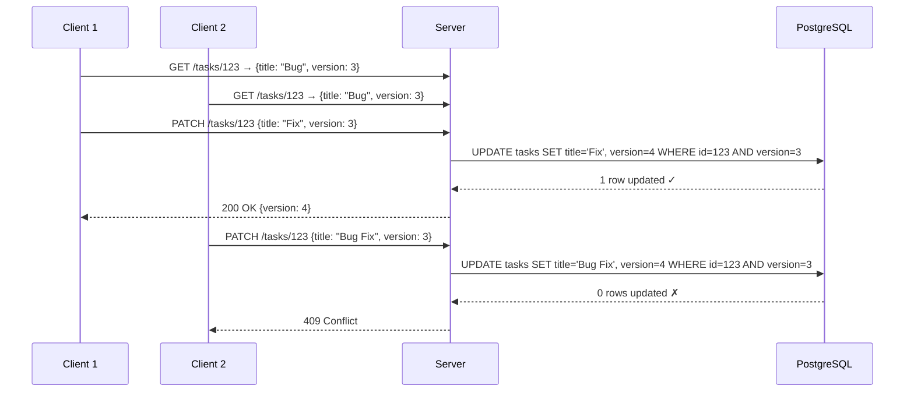

# SyncForge — Database Design

## Database Overview

SyncForge uses **PostgreSQL 16** as the primary database with **Flyway** for schema versioning. The schema is designed for data integrity, read performance, and future scalability.

### Design Principles
- Normalize by default; denormalize only with measured justification
- UUID v7 primary keys for all tables
- Explicit foreign keys with appropriate cascade rules
- Optimistic locking via `version` columns on mutable entities
- Audit fields (`created_at`, `updated_at`) on all mutable entities
- Soft delete where conversation context must be preserved (comments only)
- Timestamps stored as `TIMESTAMP WITH TIME ZONE` in UTC

---

## Table Specifications

### users

#### Purpose
Stores user accounts, credentials, and preferences.

#### Columns

| Column | Type | Nullable | Default | Constraints |
|---|---|---|---|---|
| `id` | UUID | NO | — | PK |
| `email` | VARCHAR(255) | NO | — | UNIQUE |
| `password_hash` | VARCHAR(255) | NO | — | — |
| `display_name` | VARCHAR(100) | NO | — | — |
| `status` | VARCHAR(20) | NO | `'PENDING'` | CHECK (PENDING, ACTIVE, SUSPENDED, DEACTIVATED) |
| `preferences` | JSONB | NO | `'{}'` | — |
| `version` | INTEGER | NO | `0` | — |
| `created_at` | TIMESTAMPTZ | NO | `NOW()` | — |
| `updated_at` | TIMESTAMPTZ | NO | `NOW()` | — |

#### Indexes

| Index | Columns | Type | Justification |
|---|---|---|---|
| `pk_users` | `id` | PK (B-tree) | Primary key |
| `uk_users_email` | `LOWER(email)` | UNIQUE | Case-insensitive login lookup |
| `idx_users_status` | `status` | B-tree | Filter active/pending users |
| `idx_users_search` | `search_vector` | GIN | Full-text search on display_name, email |

#### Query Patterns
- **Login**: `SELECT * FROM users WHERE LOWER(email) = LOWER(?)` — uses `uk_users_email`
- **Profile lookup**: `SELECT * FROM users WHERE id = ?` — uses PK
- **Batch lookup**: `SELECT * FROM users WHERE id IN (...)` — uses PK
- **Search**: `SELECT * FROM users WHERE search_vector @@ to_tsquery(?)` — uses GIN index

#### Growth
- Expected: 10,000 rows
- Growth: ~500/month
- No scaling concerns at this volume

---

### workspaces

#### Purpose
Stores workspace definitions.

#### Columns

| Column | Type | Nullable | Default | Constraints |
|---|---|---|---|---|
| `id` | UUID | NO | — | PK |
| `name` | VARCHAR(100) | NO | — | — |
| `slug` | VARCHAR(100) | NO | — | UNIQUE |
| `description` | VARCHAR(500) | YES | — | — |
| `owner_id` | UUID | NO | — | FK → users(id) |
| `version` | INTEGER | NO | `0` | — |
| `created_at` | TIMESTAMPTZ | NO | `NOW()` | — |
| `updated_at` | TIMESTAMPTZ | NO | `NOW()` | — |

#### Indexes

| Index | Columns | Type | Justification |
|---|---|---|---|
| `pk_workspaces` | `id` | PK | Primary key |
| `uk_workspaces_slug` | `slug` | UNIQUE | Slug-based URL lookup |
| `idx_workspaces_owner` | `owner_id` | B-tree | List workspaces owned by user |

#### Query Patterns
- **By slug**: `SELECT * FROM workspaces WHERE slug = ?`
- **By owner**: `SELECT * FROM workspaces WHERE owner_id = ?`
- **By member**: Join through `workspace_members`

---

### workspace_members

#### Purpose
Maps users to workspaces with roles.

#### Columns

| Column | Type | Nullable | Default | Constraints |
|---|---|---|---|---|
| `id` | UUID | NO | — | PK |
| `workspace_id` | UUID | NO | — | FK → workspaces(id) ON DELETE CASCADE |
| `user_id` | UUID | NO | — | FK → users(id) ON DELETE CASCADE |
| `role` | VARCHAR(20) | NO | — | CHECK (OWNER, ADMIN, MEMBER, VIEWER) |
| `joined_at` | TIMESTAMPTZ | NO | `NOW()` | — |

#### Indexes

| Index | Columns | Type | Justification |
|---|---|---|---|
| `pk_workspace_members` | `id` | PK | Primary key |
| `uk_workspace_members` | `(workspace_id, user_id)` | UNIQUE | One role per user per workspace |
| `idx_wm_user` | `user_id` | B-tree | List workspaces for a user |
| `idx_wm_workspace` | `workspace_id` | B-tree | List members of a workspace |

#### Query Patterns
- **Membership check**: `SELECT role FROM workspace_members WHERE workspace_id = ? AND user_id = ?` (hot path, cached in Redis)
- **List members**: `SELECT * FROM workspace_members wm JOIN users u ON wm.user_id = u.id WHERE wm.workspace_id = ?`
- **User's workspaces**: `SELECT * FROM workspace_members wm JOIN workspaces w ON wm.workspace_id = w.id WHERE wm.user_id = ?`

---

### workspace_invitations

#### Purpose
Tracks pending, accepted, expired, and revoked workspace invitations.

#### Columns

| Column | Type | Nullable | Default | Constraints |
|---|---|---|---|---|
| `id` | UUID | NO | — | PK |
| `workspace_id` | UUID | NO | — | FK → workspaces(id) ON DELETE CASCADE |
| `email` | VARCHAR(255) | NO | — | — |
| `role` | VARCHAR(20) | NO | `'MEMBER'` | CHECK (ADMIN, MEMBER, VIEWER) |
| `token_hash` | VARCHAR(255) | NO | — | UNIQUE |
| `status` | VARCHAR(20) | NO | `'PENDING'` | CHECK (PENDING, ACCEPTED, EXPIRED, REVOKED) |
| `invited_by` | UUID | NO | — | FK → users(id) |
| `expires_at` | TIMESTAMPTZ | NO | — | — |
| `created_at` | TIMESTAMPTZ | NO | `NOW()` | — |

#### Indexes

| Index | Columns | Type | Justification |
|---|---|---|---|
| `pk_workspace_invitations` | `id` | PK | Primary key |
| `uk_wi_token` | `token_hash` | UNIQUE | Token-based acceptance lookup |
| `idx_wi_workspace_status` | `(workspace_id, status)` | B-tree | List pending invitations |
| `idx_wi_email_status` | `(email, status)` | B-tree | Find pending invitations for user |
| `idx_wi_expires` | `expires_at` | B-tree | Cleanup job |

---

### boards

#### Purpose
Stores Kanban boards within workspaces.

#### Columns

| Column | Type | Nullable | Default | Constraints |
|---|---|---|---|---|
| `id` | UUID | NO | — | PK |
| `workspace_id` | UUID | NO | — | FK → workspaces(id) ON DELETE CASCADE |
| `name` | VARCHAR(100) | NO | — | — |
| `description` | VARCHAR(500) | YES | — | — |
| `prefix` | VARCHAR(5) | NO | — | — |
| `task_sequence` | INTEGER | NO | `0` | — |
| `archived` | BOOLEAN | NO | `FALSE` | — |
| `version` | INTEGER | NO | `0` | — |
| `created_at` | TIMESTAMPTZ | NO | `NOW()` | — |
| `updated_at` | TIMESTAMPTZ | NO | `NOW()` | — |

#### Indexes

| Index | Columns | Type | Justification |
|---|---|---|---|
| `pk_boards` | `id` | PK | Primary key |
| `idx_boards_workspace` | `(workspace_id, archived)` | B-tree | List active boards for workspace |
| `uk_boards_prefix` | `(workspace_id, prefix)` | UNIQUE | Unique task identifier prefix per workspace |

#### Query Patterns
- **Board list**: `SELECT * FROM boards WHERE workspace_id = ? AND archived = false ORDER BY created_at DESC`
- **Board load**: `SELECT * FROM boards WHERE id = ?` — includes columns and tasks via separate queries

---

### board_columns

#### Purpose
Stores columns within boards, ordered by fractional index.

#### Columns

| Column | Type | Nullable | Default | Constraints |
|---|---|---|---|---|
| `id` | UUID | NO | — | PK |
| `board_id` | UUID | NO | — | FK → boards(id) ON DELETE CASCADE |
| `name` | VARCHAR(100) | NO | — | — |
| `position` | VARCHAR(255) | NO | — | — |
| `task_limit` | INTEGER | YES | — | CHECK (task_limit > 0) |
| `version` | INTEGER | NO | `0` | — |
| `created_at` | TIMESTAMPTZ | NO | `NOW()` | — |
| `updated_at` | TIMESTAMPTZ | NO | `NOW()` | — |

#### Indexes

| Index | Columns | Type | Justification |
|---|---|---|---|
| `pk_board_columns` | `id` | PK | Primary key |
| `idx_bc_board_position` | `(board_id, position)` | B-tree | Ordered column listing |

---

### tasks

#### Purpose
Stores tasks (cards) within board columns.

#### Columns

| Column | Type | Nullable | Default | Constraints |
|---|---|---|---|---|
| `id` | UUID | NO | — | PK |
| `column_id` | UUID | NO | — | FK → board_columns(id) ON DELETE RESTRICT |
| `board_id` | UUID | NO | — | FK → boards(id) ON DELETE CASCADE |
| `title` | VARCHAR(255) | NO | — | — |
| `description` | TEXT | YES | — | — |
| `priority` | VARCHAR(20) | NO | `'NONE'` | CHECK (URGENT, HIGH, MEDIUM, LOW, NONE) |
| `status` | VARCHAR(20) | NO | `'OPEN'` | CHECK (OPEN, IN_PROGRESS, DONE, ARCHIVED) |
| `position` | VARCHAR(255) | NO | — | — |
| `identifier` | VARCHAR(20) | NO | — | — |
| `creator_id` | UUID | NO | — | FK → users(id) |
| `due_date` | DATE | YES | — | — |
| `archived` | BOOLEAN | NO | `FALSE` | — |
| `version` | INTEGER | NO | `0` | — |
| `search_vector` | TSVECTOR | YES | — | Generated |
| `created_at` | TIMESTAMPTZ | NO | `NOW()` | — |
| `updated_at` | TIMESTAMPTZ | NO | `NOW()` | — |

#### Indexes

| Index | Columns | Type | Justification |
|---|---|---|---|
| `pk_tasks` | `id` | PK | Primary key |
| `uk_tasks_identifier` | `(board_id, identifier)` | UNIQUE | Unique task identifier per board |
| `idx_tasks_column_position` | `(column_id, position)` WHERE `archived = false` | B-tree (partial) | Ordered task listing within column |
| `idx_tasks_board` | `(board_id, archived)` | B-tree | All tasks for board load |
| `idx_tasks_creator` | `creator_id` | B-tree | Tasks created by user |
| `idx_tasks_priority` | `(board_id, priority)` | B-tree | Filter by priority |
| `idx_tasks_status` | `(board_id, status)` | B-tree | Filter by status |
| `idx_tasks_due_date` | `due_date` WHERE `due_date IS NOT NULL` | B-tree (partial) | Due date filtering/sorting |
| `idx_tasks_search` | `search_vector` | GIN | Full-text search |

#### Search Vector Trigger

```sql
CREATE OR REPLACE FUNCTION tasks_search_vector_update() RETURNS trigger AS $$
BEGIN
    NEW.search_vector :=
        setweight(to_tsvector('english', COALESCE(NEW.title, '')), 'A') ||
        setweight(to_tsvector('english', COALESCE(NEW.description, '')), 'B');
    RETURN NEW;
END;
$$ LANGUAGE plpgsql;

CREATE TRIGGER tasks_search_vector_trigger
    BEFORE INSERT OR UPDATE OF title, description ON tasks
    FOR EACH ROW EXECUTE FUNCTION tasks_search_vector_update();
```

#### Growth
- Expected: 100,000 rows
- Growth: ~5,000/month
- Partition strategy: Not needed at this scale. If growth exceeds 1M, partition by `board_id` range.

---

### task_assignments

#### Purpose
Maps users to tasks (many-to-many).

#### Columns

| Column | Type | Nullable | Default | Constraints |
|---|---|---|---|---|
| `id` | UUID | NO | — | PK |
| `task_id` | UUID | NO | — | FK → tasks(id) ON DELETE CASCADE |
| `user_id` | UUID | NO | — | FK → users(id) ON DELETE CASCADE |
| `assigned_at` | TIMESTAMPTZ | NO | `NOW()` | — |

#### Indexes

| Index | Columns | Type | Justification |
|---|---|---|---|
| `pk_task_assignments` | `id` | PK | Primary key |
| `uk_task_assignments` | `(task_id, user_id)` | UNIQUE | One assignment per user per task |
| `idx_ta_user` | `user_id` | B-tree | Tasks assigned to user |

---

### labels

#### Purpose
Stores workspace-scoped labels for task categorization.

#### Columns

| Column | Type | Nullable | Default | Constraints |
|---|---|---|---|---|
| `id` | UUID | NO | — | PK |
| `workspace_id` | UUID | NO | — | FK → workspaces(id) ON DELETE CASCADE |
| `name` | VARCHAR(50) | NO | — | — |
| `color` | VARCHAR(7) | NO | — | — |
| `created_at` | TIMESTAMPTZ | NO | `NOW()` | — |

#### Indexes

| Index | Columns | Type | Justification |
|---|---|---|---|
| `pk_labels` | `id` | PK | Primary key |
| `uk_labels_name` | `(workspace_id, LOWER(name))` | UNIQUE | Unique label name per workspace |

---

### task_labels

#### Purpose
Join table for tasks-to-labels many-to-many relationship.

#### Columns

| Column | Type | Nullable | Default | Constraints |
|---|---|---|---|---|
| `task_id` | UUID | NO | — | FK → tasks(id) ON DELETE CASCADE |
| `label_id` | UUID | NO | — | FK → labels(id) ON DELETE CASCADE |

#### Keys
- **Composite PK**: `(task_id, label_id)`

---

### comments

#### Purpose
Stores comments on tasks with soft delete support.

#### Columns

| Column | Type | Nullable | Default | Constraints |
|---|---|---|---|---|
| `id` | UUID | NO | — | PK |
| `task_id` | UUID | NO | — | FK → tasks(id) ON DELETE CASCADE |
| `author_id` | UUID | NO | — | FK → users(id) |
| `content` | TEXT | NO | — | — |
| `deleted` | BOOLEAN | NO | `FALSE` | — |
| `version` | INTEGER | NO | `0` | — |
| `search_vector` | TSVECTOR | YES | — | Generated |
| `created_at` | TIMESTAMPTZ | NO | `NOW()` | — |
| `updated_at` | TIMESTAMPTZ | NO | `NOW()` | — |

#### Indexes

| Index | Columns | Type | Justification |
|---|---|---|---|
| `pk_comments` | `id` | PK | Primary key |
| `idx_comments_task` | `(task_id, created_at DESC)` | B-tree | Paginated comments for task |
| `idx_comments_author` | `author_id` | B-tree | Comments by user |
| `idx_comments_search` | `search_vector` | GIN | Full-text search |

---

### mentions

#### Purpose
Tracks @mentions within comments for notification delivery.

#### Columns

| Column | Type | Nullable | Default | Constraints |
|---|---|---|---|---|
| `id` | UUID | NO | — | PK |
| `comment_id` | UUID | NO | — | FK → comments(id) ON DELETE CASCADE |
| `mentioned_user_id` | UUID | NO | — | FK → users(id) ON DELETE CASCADE |
| `created_at` | TIMESTAMPTZ | NO | `NOW()` | — |

#### Indexes

| Index | Columns | Type | Justification |
|---|---|---|---|
| `pk_mentions` | `id` | PK | Primary key |
| `uk_mentions` | `(comment_id, mentioned_user_id)` | UNIQUE | One mention per user per comment |
| `idx_mentions_user` | `mentioned_user_id` | B-tree | Mentions for user |

---

### notifications

#### Purpose
Stores in-app notifications for users.

#### Columns

| Column | Type | Nullable | Default | Constraints |
|---|---|---|---|---|
| `id` | UUID | NO | — | PK |
| `user_id` | UUID | NO | — | FK → users(id) ON DELETE CASCADE |
| `type` | VARCHAR(50) | NO | — | — |
| `title` | VARCHAR(255) | NO | — | — |
| `message` | TEXT | YES | — | — |
| `reference_type` | VARCHAR(50) | YES | — | — |
| `reference_id` | UUID | YES | — | — |
| `read` | BOOLEAN | NO | `FALSE` | — |
| `created_at` | TIMESTAMPTZ | NO | `NOW()` | — |

#### Indexes

| Index | Columns | Type | Justification |
|---|---|---|---|
| `pk_notifications` | `id` | PK | Primary key |
| `idx_notif_user_read` | `(user_id, read, created_at DESC)` | B-tree | Unread notifications, newest first |
| `idx_notif_user_created` | `(user_id, created_at DESC)` | B-tree | All notifications, newest first |
| `idx_notif_cleanup` | `created_at` | B-tree | 90-day retention cleanup |

#### Growth
- Expected: ~500,000 rows (50 per user × 10,000 users)
- Retention: 90-day cleanup keeps size bounded
- After cleanup: ~150,000 active rows at steady state

---

### activity_logs

#### Purpose
Audit trail for all significant business actions.

#### Columns

| Column | Type | Nullable | Default | Constraints |
|---|---|---|---|---|
| `id` | UUID | NO | — | PK |
| `workspace_id` | UUID | NO | — | FK → workspaces(id) ON DELETE CASCADE |
| `actor_id` | UUID | NO | — | FK → users(id) |
| `entity_type` | VARCHAR(50) | NO | — | — |
| `entity_id` | UUID | NO | — | — |
| `action` | VARCHAR(50) | NO | — | — |
| `changes` | JSONB | YES | — | — |
| `created_at` | TIMESTAMPTZ | NO | `NOW()` | — |

#### Indexes

| Index | Columns | Type | Justification |
|---|---|---|---|
| `pk_activity_logs` | `id` | PK | Primary key |
| `idx_al_entity` | `(entity_type, entity_id, created_at DESC)` | B-tree | Activity timeline for entity |
| `idx_al_workspace` | `(workspace_id, created_at DESC)` | B-tree | Workspace-wide activity feed |
| `idx_al_actor` | `actor_id` | B-tree | Activity by user |

#### Growth
- Expected: ~500,000 rows
- Growth: ~20,000/month
- Retention: 1 year; archive to cold storage after that (future)

---

### refresh_tokens

(Documented in [05-authentication-authorization.md](file:///Users/slayer/SyncForge/docs/05-authentication-authorization.md))

### verification_tokens

#### Columns

| Column | Type | Nullable | Default | Constraints |
|---|---|---|---|---|
| `id` | UUID | NO | — | PK |
| `user_id` | UUID | NO | — | FK → users(id) ON DELETE CASCADE |
| `token_hash` | VARCHAR(255) | NO | — | UNIQUE |
| `status` | VARCHAR(20) | NO | `'PENDING'` | CHECK (PENDING, USED, EXPIRED) |
| `expires_at` | TIMESTAMPTZ | NO | — | — |
| `created_at` | TIMESTAMPTZ | NO | `NOW()` | — |

#### Indexes
- PK on `id`
- UNIQUE on `token_hash`
- Index on `(user_id, status)` for finding pending tokens
- Index on `expires_at` for cleanup

### password_reset_tokens

Identical structure to `verification_tokens` with 1-hour expiration.

---

## Optimistic Locking

### Strategy
Entities that support concurrent updates include a `version` column managed by JPA's `@Version` annotation.

### Entities with Version Column
- `users` — concurrent profile updates
- `workspaces` — concurrent settings updates
- `boards` — concurrent board updates
- `board_columns` — concurrent column updates
- `tasks` — concurrent task updates (highest contention)
- `comments` — concurrent comment edits

### Update Workflow



### Conflict Response

```json
{
  "status": 409,
  "error": "CONFLICT",
  "message": "This resource has been modified by another user. Please refresh and try again.",
  "traceId": "abc-123"
}
```

### Client Behavior
1. Receive 409 Conflict
2. Fetch the latest version of the resource
3. Display the updated data to the user
4. Allow the user to re-apply their changes

---

## Transaction Strategy

### Principles
- Keep transactions as short as possible
- Use `@Transactional` at the service layer (not controller)
- Read-only operations use `@Transactional(readOnly = true)`
- Default isolation level: `READ_COMMITTED` (PostgreSQL default)
- Default propagation: `REQUIRED`
- Transaction timeout: 10 seconds

### Transaction Boundaries by Operation

| Operation | Boundary | Notes |
|---|---|---|
| Registration | User creation + verification token | Single transaction |
| Login | Read-only (user lookup) | Read-only transaction |
| Email verification | Token update + user status update | Single transaction |
| Password reset | Token update + password update + revoke tokens | Single transaction |
| Workspace creation | Workspace + owner membership | Single transaction |
| Invitation acceptance | Invitation status update + membership creation | Single transaction |
| Task creation | Task insert + sequence increment | Single transaction |
| Task update | Task update | Single transaction |
| Task movement | Task column/position update | Single transaction |
| Comment creation | Comment insert + mention inserts | Single transaction |
| Notification creation | Notification insert | Single transaction |

### Domain Events and Transactions
- Events published via `@TransactionalEventListener(phase = AFTER_COMMIT)` fire **after** the transaction commits
- If the transaction rolls back, no events are published
- Event handlers (Activity, Notification) run in their own transactions

### Deadlock Prevention
- Always access tables in consistent order within a transaction
- Keep transactions short (< 100ms for typical operations)
- Use optimistic locking instead of `SELECT FOR UPDATE`
- If a deadlock occurs, Spring retries the transaction once (`@Retryable` on specific service methods)

---

## Consistency Model

### Registration
- **Boundary**: Single transaction (user + verification token)
- **Guarantee**: User and token are created atomically
- **Failure**: Both roll back; no orphaned records
- **Recovery**: User retries registration

### Workspace Creation
- **Boundary**: Single transaction (workspace + owner membership)
- **Guarantee**: Workspace always has an owner
- **Failure**: Both roll back
- **Recovery**: User retries

### Invitation Acceptance
- **Boundary**: Single transaction (invitation status + membership)
- **Guarantee**: Invitation is marked accepted and membership is created atomically
- **Failure**: Both roll back; invitation remains pending
- **Recovery**: User retries acceptance

### Task Creation
- **Boundary**: Single transaction (task + board sequence increment)
- **Guarantee**: Task identifier is unique (atomic sequence increment)
- **Failure**: Both roll back; sequence is not incremented
- **Recovery**: User retries

### Task Movement
- **Boundary**: Single transaction (column_id + position update)
- **Guarantee**: Task is in exactly one column with a valid position
- **Failure**: Roll back; task remains in original position
- **Recovery**: User retries; optimistic locking prevents stale moves

---

## Flyway Migration Strategy

### Naming Convention
```
V{version}__{description}.sql
```

Examples:
```
V001__create_users_table.sql
V002__create_workspaces_table.sql
V003__create_workspace_members_table.sql
V004__create_workspace_invitations_table.sql
V005__create_boards_table.sql
V006__create_board_columns_table.sql
V007__create_tasks_table.sql
V008__create_task_assignments_table.sql
V009__create_labels_table.sql
V010__create_task_labels_table.sql
V011__create_comments_table.sql
V012__create_mentions_table.sql
V013__create_notifications_table.sql
V014__create_activity_logs_table.sql
V015__create_refresh_tokens_table.sql
V016__create_verification_tokens_table.sql
V017__create_password_reset_tokens_table.sql
V018__create_search_vectors_and_triggers.sql
V019__seed_reference_data.sql
```

### Versioning Rules
- Version numbers are zero-padded three digits: `V001`, `V002`, etc.
- Each migration is a single SQL file
- Migrations are immutable once deployed — never edit a released migration
- New changes require new migration files
- Repeatable migrations (`R__`) are used only for stored procedures and triggers

### Rollback Philosophy
- Flyway does not support automatic rollback
- Write **compensating migrations** for rollbacks: `V020__rollback_v019.sql`
- In development: use `flyway clean` + `flyway migrate` for fresh starts
- In production: always forward-migrate

### Seed Data
- `V019__seed_reference_data.sql` contains test data for development only
- Use Spring profiles to control seed data execution
- Production migrations never include test data

---

## Database Performance

### Connection Pooling (HikariCP)

| Property | Development | Production |
|---|---|---|
| `maximumPoolSize` | 5 | 10 |
| `minimumIdle` | 2 | 5 |
| `connectionTimeout` | 10s | 10s |
| `idleTimeout` | 300s | 300s |
| `maxLifetime` | 900s | 900s |

**Justification**: With 2,000 concurrent users and multiple app instances, each instance needs ~10 connections. PostgreSQL default `max_connections` is 100, supporting up to 10 instances.

### N+1 Prevention
- Use `@EntityGraph` or `JOIN FETCH` for associations loaded in list queries
- Board load: fetch board + columns in one query; tasks in a second query (by board_id)
- Task list: fetch tasks + labels + assignees using batch fetching (`@BatchSize(size = 20)`)
- Never use `FetchType.EAGER` on collections

### Pagination
- **Offset pagination**: `LIMIT ? OFFSET ?` for bounded lists (tasks, boards, members)
- **Cursor pagination**: `WHERE created_at < ? ORDER BY created_at DESC LIMIT ?` for activity logs and notifications
- Always include `ORDER BY` with pagination to ensure deterministic results

### Batch Operations
- Notification cleanup: `DELETE FROM notifications WHERE created_at < ? LIMIT 1000` (batched to avoid long locks)
- Token cleanup: `DELETE FROM refresh_tokens WHERE expires_at < NOW()` (bounded by TTL)
- Use `@Modifying` queries for bulk updates

### Query Planning
- Run `EXPLAIN ANALYZE` on all queries during development
- Ensure all WHERE clauses use indexed columns
- Avoid `SELECT *` — project only needed columns in high-volume queries
- Use partial indexes where applicable (e.g., `WHERE archived = false`)
