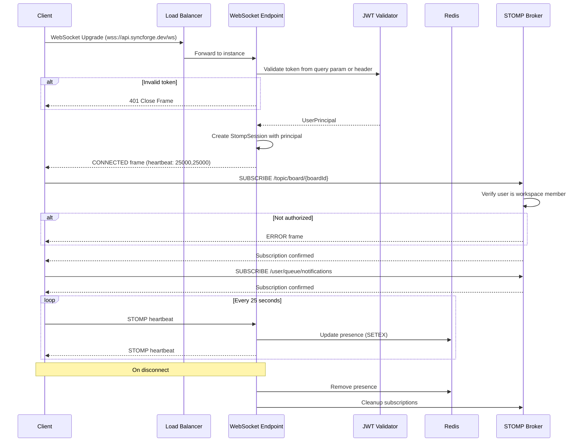
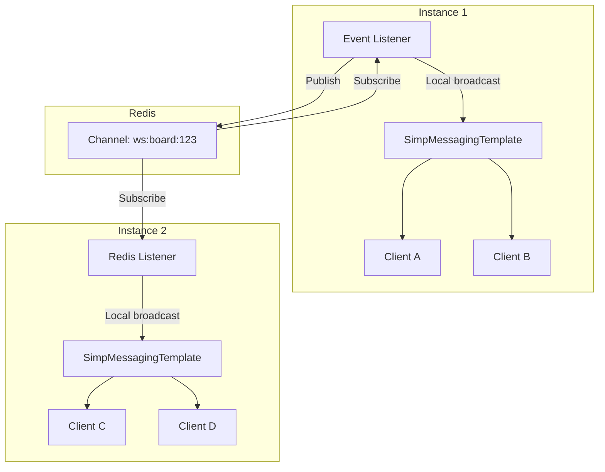
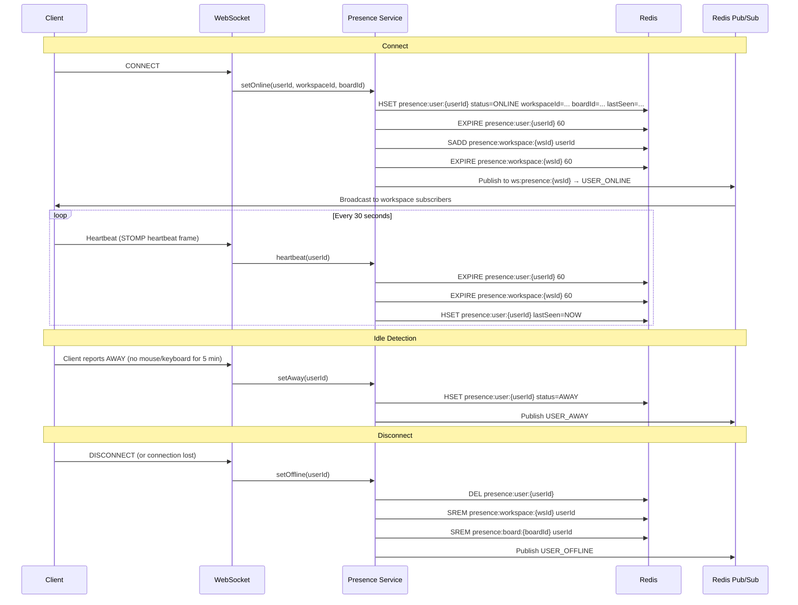

# SyncForge — Real-Time Collaboration

## Architecture Overview

SyncForge uses **Spring WebSocket with STOMP** protocol for real-time collaboration, backed by **Redis Pub/Sub** for multi-instance broadcast.

### Supported Real-Time Features

| Feature | Channel Type | Latency Target |
|---|---|---|
| Board updates (task CRUD, moves) | Board topic | < 150 ms |
| Column changes | Board topic | < 150 ms |
| New comments | Board topic | < 150 ms |
| Notifications | User queue | < 500 ms |
| Presence changes | Workspace topic | < 150 ms |

---

## WebSocket Connection Lifecycle



### Connection Authentication

WebSocket connections are authenticated during the STOMP handshake via a `ChannelInterceptor`:

```java
@Component
public class WebSocketAuthInterceptor implements ChannelInterceptor {

    @Override
    public Message<?> preSend(Message<?> message, MessageChannel channel) {
        StompHeaderAccessor accessor = StompHeaderAccessor.wrap(message);

        if (StompCommand.CONNECT.equals(accessor.getCommand())) {
            String token = accessor.getFirstNativeHeader("Authorization");
            if (token != null && token.startsWith("Bearer ")) {
                token = token.substring(7);
            } else {
                // Fallback: token in query parameter (for browsers that can't set WS headers)
                token = accessor.getFirstNativeHeader("token");
            }

            UserPrincipal principal = jwtTokenProvider.validateAndGetPrincipal(token);
            accessor.setUser(principal);
        }
        return message;
    }
}
```

### Subscription Authorization

```java
@Component
public class WebSocketSubscriptionInterceptor implements ChannelInterceptor {

    @Override
    public Message<?> preSend(Message<?> message, MessageChannel channel) {
        StompHeaderAccessor accessor = StompHeaderAccessor.wrap(message);

        if (StompCommand.SUBSCRIBE.equals(accessor.getCommand())) {
            String destination = accessor.getDestination();
            UserPrincipal principal = (UserPrincipal) accessor.getUser();

            if (destination.startsWith("/topic/board/")) {
                UUID boardId = extractBoardId(destination);
                Board board = boardService.getBoard(boardId);
                workspaceAuthService.checkPermission(
                    principal.getId(), board.getWorkspaceId(), WorkspaceRole.VIEWER);
            }
            // /user/queue/* destinations are automatically scoped to the authenticated user
        }
        return message;
    }
}
```

---

## WebSocket Configuration

```java
@Configuration
@EnableWebSocketMessageBroker
public class WebSocketConfig implements WebSocketMessageBrokerConfigurer {

    @Override
    public void configureMessageBroker(MessageBrokerRegistry registry) {
        registry.enableSimpleBroker("/topic", "/queue")
            .setHeartbeatValue(new long[]{25000, 25000})  // 25-second heartbeats
            .setTaskScheduler(heartbeatScheduler());
        registry.setApplicationDestinationPrefixes("/app");
        registry.setUserDestinationPrefix("/user");
    }

    @Override
    public void registerStompEndpoints(StompEndpointRegistry registry) {
        registry.addEndpoint("/ws")
            .setAllowedOriginPatterns("http://localhost:*")
            .withSockJS();  // Fallback for browsers without WebSocket support
    }

    @Override
    public void configureClientInboundChannel(ChannelRegistration registration) {
        registration.interceptors(webSocketAuthInterceptor, webSocketSubscriptionInterceptor);
    }
}
```

---

## Channel Design

### Board Channel

| Property | Value |
|---|---|
| **Destination** | `/topic/board/{boardId}` |
| **Purpose** | Real-time board updates (tasks, columns) |
| **Publishers** | WebSocket Relay (server-side only) |
| **Subscribers** | Users viewing the board |
| **Authorization** | VIEWER+ in the board's workspace |
| **Event Types** | `TASK_CREATED`, `TASK_UPDATED`, `TASK_MOVED`, `TASK_ARCHIVED`, `TASK_ASSIGNED`, `TASK_UNASSIGNED`, `LABEL_ADDED`, `LABEL_REMOVED`, `COLUMN_CREATED`, `COLUMN_UPDATED`, `COLUMN_DELETED`, `COLUMN_REORDERED`, `COMMENT_ADDED`, `COMMENT_UPDATED`, `COMMENT_DELETED` |

### Workspace Channel

| Property | Value |
|---|---|
| **Destination** | `/topic/workspace/{workspaceId}` |
| **Purpose** | Workspace-level updates (board changes, member changes) |
| **Publishers** | WebSocket Relay |
| **Subscribers** | Users in the workspace |
| **Authorization** | VIEWER+ in the workspace |
| **Event Types** | `BOARD_CREATED`, `BOARD_UPDATED`, `BOARD_ARCHIVED`, `MEMBER_JOINED`, `MEMBER_LEFT`, `MEMBER_ROLE_CHANGED` |

### User Notification Channel

| Property | Value |
|---|---|
| **Destination** | `/user/queue/notifications` |
| **Purpose** | Private notifications for the authenticated user |
| **Publishers** | Notification Module (via WebSocket Relay) |
| **Subscribers** | The authenticated user only |
| **Authorization** | Automatic — Spring's user destination prefix ensures isolation |
| **Event Types** | `NOTIFICATION_CREATED` |

### Presence Channel

| Property | Value |
|---|---|
| **Destination** | `/topic/presence/{workspaceId}` |
| **Purpose** | Presence updates for workspace members |
| **Publishers** | Presence Module |
| **Subscribers** | Users in the workspace |
| **Authorization** | VIEWER+ in the workspace |
| **Event Types** | `USER_ONLINE`, `USER_OFFLINE`, `USER_AWAY`, `PRESENCE_UPDATE` |

---

## Message Format

### WebSocket Message Envelope

```json
{
  "id": "msg-uuid",
  "type": "TASK_UPDATED",
  "timestamp": "2024-01-15T10:30:00Z",
  "correlationId": "req-uuid",
  "workspaceId": "workspace-uuid",
  "actor": {
    "id": "user-uuid",
    "displayName": "John Doe",
    "avatarUrl": "https://gravatar.com/..."
  },
  "payload": { },
  "version": 1
}
```

| Field | Type | Description |
|---|---|---|
| `id` | UUID | Unique message identifier for client-side deduplication |
| `type` | String | Event type enum |
| `timestamp` | ISO-8601 | Server timestamp |
| `correlationId` | UUID | Links to the HTTP request that caused this event |
| `workspaceId` | UUID | Workspace context |
| `actor` | Object | User who performed the action |
| `payload` | Object | Event-specific data |
| `version` | Integer | Message format version for future evolution |

### Payload Examples

**TASK_CREATED**:
```json
{
  "task": {
    "id": "task-uuid",
    "identifier": "SF-42",
    "title": "Implement auth",
    "columnId": "column-uuid",
    "position": "aV",
    "priority": "HIGH",
    "status": "OPEN",
    "assignees": [],
    "labels": []
  }
}
```

**TASK_MOVED**:
```json
{
  "taskId": "task-uuid",
  "fromColumnId": "old-column-uuid",
  "toColumnId": "new-column-uuid",
  "newPosition": "bK"
}
```

**NOTIFICATION_CREATED**:
```json
{
  "notification": {
    "id": "notif-uuid",
    "type": "TASK_ASSIGNED",
    "title": "You were assigned to SF-42",
    "referenceType": "TASK",
    "referenceId": "task-uuid",
    "read": false,
    "createdAt": "2024-01-15T10:30:00Z"
  }
}
```

### Unknown Message Handling
- Client should ignore unknown `type` values (forward compatibility)
- Log unknown types at DEBUG level

### Duplicate Handling
- Client maintains a set of recently seen message `id`s (last 100)
- Duplicate messages are silently discarded

---

## Redis Pub/Sub Relay

### Architecture for Multi-Instance Broadcast



### Redis Pub/Sub Channels

| Channel Pattern | Purpose |
|---|---|
| `ws:board:{boardId}` | Board-level events |
| `ws:workspace:{workspaceId}` | Workspace-level events |
| `ws:user:{userId}` | User-specific notifications |
| `ws:presence:{workspaceId}` | Presence updates |

### Relay Implementation

```java
@Component
public class WebSocketRedisRelay {

    private final RedisTemplate<String, String> redisTemplate;
    private final SimpMessagingTemplate messagingTemplate;
    private final ObjectMapper objectMapper;

    // PUBLISHING: Domain event → Redis Pub/Sub
    @TransactionalEventListener(phase = AFTER_COMMIT)
    public void onTaskUpdated(TaskUpdated event) {
        WebSocketMessage msg = WebSocketMessage.builder()
            .id(UUID.randomUUID())
            .type("TASK_UPDATED")
            .timestamp(Instant.now())
            .workspaceId(event.getWorkspaceId())
            .actor(event.getActor())
            .payload(event.getPayload())
            .build();

        String channel = "ws:board:" + event.getBoardId();
        redisTemplate.convertAndSend(channel, objectMapper.writeValueAsString(msg));
    }

    // SUBSCRIBING: Redis Pub/Sub → Local WebSocket broadcast
    @PostConstruct
    public void subscribeToRedisChannels() {
        redisMessageListenerContainer.addMessageListener(
            (message, pattern) -> {
                String channel = new String(message.getChannel());
                String body = new String(message.getBody());
                WebSocketMessage msg = objectMapper.readValue(body, WebSocketMessage.class);

                if (channel.startsWith("ws:board:")) {
                    String boardId = channel.substring("ws:board:".length());
                    messagingTemplate.convertAndSend("/topic/board/" + boardId, msg);
                } else if (channel.startsWith("ws:user:")) {
                    String userId = channel.substring("ws:user:".length());
                    messagingTemplate.convertAndSendToUser(userId, "/queue/notifications", msg);
                }
                // ... other channel patterns
            },
            new PatternTopic("ws:*")
        );
    }
}
```

---

## Presence System

### Presence States

| State | Description | Trigger |
|---|---|---|
| `ONLINE` | User is actively connected | WebSocket connect + heartbeat |
| `AWAY` | User is connected but inactive | No client activity for 5 minutes (client reports) |
| `OFFLINE` | User is not connected | WebSocket disconnect or heartbeat TTL expires |

### Presence Lifecycle



### Distributed Presence

**Multiple instances, shared Redis, no sticky sessions:**

1. **Heartbeat propagation**: All instances write to the same Redis keys. Heartbeats are idempotent — last write wins with TTL refresh.

2. **Unexpected disconnect**: The instance holding the connection detects the disconnect and removes presence from Redis. If the instance crashes, Redis TTL (60 seconds) ensures eventual cleanup.

3. **Reconnection**: Client reconnects (potentially to a different instance). The new instance creates presence in Redis. No coordination with the old instance is needed.

4. **Server restart recovery**: Users connected to the restarting instance lose their connections. Clients auto-reconnect with exponential backoff. Redis TTL cleans up stale presence within 60 seconds.

5. **Redis restart recovery**: All presence data is lost. Clients continue heartbeating; presence repopulates within 30 seconds (next heartbeat cycle).

---

## Client-Side WebSocket Integration

### Connection Manager

```typescript
class WebSocketManager {
  private client: Client;
  private subscriptions: Map<string, StompSubscription> = new Map();
  private reconnectAttempts = 0;
  private maxReconnectAttempts = 10;

  connect(token: string) {
    this.client = new Client({
      brokerURL: `${WS_URL}/ws`,
      connectHeaders: { Authorization: `Bearer ${token}` },
      heartbeatIncoming: 25000,
      heartbeatOutgoing: 25000,
      reconnectDelay: (attempt) => Math.min(1000 * Math.pow(2, attempt), 30000),
      onConnect: () => this.onConnected(),
      onDisconnect: () => this.onDisconnected(),
      onStompError: (frame) => this.onError(frame),
    });
    this.client.activate();
  }

  subscribeToBoard(boardId: string, callback: (msg: WebSocketMessage) => void) {
    const sub = this.client.subscribe(`/topic/board/${boardId}`, (message) => {
      const msg = JSON.parse(message.body);
      if (!this.isDuplicate(msg.id)) {
        callback(msg);
      }
    });
    this.subscriptions.set(`board:${boardId}`, sub);
  }

  subscribeToNotifications(callback: (msg: WebSocketMessage) => void) {
    this.client.subscribe('/user/queue/notifications', (message) => {
      callback(JSON.parse(message.body));
    });
  }
}
```

### Optimistic UI Updates

1. User performs action (e.g., moves a task)
2. Client immediately updates local state (optimistic)
3. Client sends REST request to server
4. Server processes, persists, publishes event
5. WebSocket broadcast arrives (including to the originator)
6. Client receives broadcast:
   - If `correlationId` matches the pending request → confirm optimistic update
   - If `correlationId` does not match → apply server state (another user's change)
7. If REST request fails → revert optimistic update

### Reconnection Strategy

| Attempt | Delay | Action |
|---|---|---|
| 1 | 1 second | Reconnect |
| 2 | 2 seconds | Reconnect |
| 3 | 4 seconds | Reconnect |
| 4 | 8 seconds | Reconnect |
| 5 | 16 seconds | Reconnect + show "Reconnecting..." |
| 6-9 | 30 seconds | Reconnect + show "Connection lost" |
| 10 | — | Stop reconnecting; show "Please refresh" |

After reconnecting, the client:
1. Re-subscribes to all active channels
2. Fetches the latest state from REST APIs (boards, notifications)
3. Merges any missed updates
