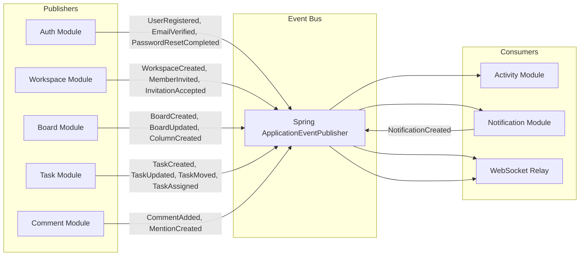

# SyncForge — Domain Events

## Event Architecture

SyncForge uses **synchronous internal domain events** via Spring's `ApplicationEventPublisher`. Events are the primary mechanism for cross-module communication without creating direct dependencies.

### Publication Strategy
- Events are published using `ApplicationEventPublisher.publishEvent()`
- Event listeners use `@TransactionalEventListener(phase = AFTER_COMMIT)` to ensure events fire only after the originating transaction commits successfully
- If the transaction rolls back, no events fire
- Event listeners execute in the **same thread** as the publisher (synchronous)

### Why Synchronous?
- Guarantees ordering — events are processed in publication order
- Simpler error handling — exceptions propagate to the caller
- No infrastructure overhead — no message broker needed
- Adequate throughput — 100 task updates/sec is within in-process event handling capacity
- Debugging — full stack trace from publisher through listener

### Failure Handling
- If an event listener throws an exception, it does **not** roll back the originating transaction (since listeners run `AFTER_COMMIT`)
- Failed event handling is logged as an error with correlation ID
- For critical operations (notification creation), failures are caught and logged but do not impact the user's request
- No automatic retry — failed events are logged for manual investigation

### Ordering Guarantees
- Events within a single transaction are processed in publication order
- No ordering guarantee across different transactions
- This is acceptable because each event is independent and idempotent

---

## Event Catalog

### Base Event Structure

```java
public abstract class DomainEvent {
    private final UUID eventId;          // Unique event identifier
    private final Instant timestamp;      // Event creation time
    private final UUID actorId;          // User who triggered the event
    private final UUID workspaceId;      // Workspace context (nullable for auth events)

    protected DomainEvent(UUID actorId, UUID workspaceId) {
        this.eventId = UUID.randomUUID();
        this.timestamp = Instant.now();
        this.actorId = actorId;
        this.workspaceId = workspaceId;
    }
}
```

---

### Authentication Events

#### UserRegistered

| Property | Description |
|---|---|
| **Publisher** | Auth Module (`AuthService.register()`) |
| **Consumers** | Activity Module (log registration) |
| **Trigger** | Successful user registration |
| **Execution** | After commit |
| **Payload** | `userId`, `email`, `displayName` |

#### EmailVerified

| Property | Description |
|---|---|
| **Publisher** | Auth Module (`AuthService.verifyEmail()`) |
| **Consumers** | Activity Module (log verification) |
| **Trigger** | Successful email verification |
| **Execution** | After commit |
| **Payload** | `userId`, `email` |

#### PasswordResetRequested

| Property | Description |
|---|---|
| **Publisher** | Auth Module (`AuthService.forgotPassword()`) |
| **Consumers** | None (email is sent directly by Auth module) |
| **Trigger** | Forgot password request for existing user |
| **Execution** | After commit |
| **Payload** | `userId`, `email` |

#### PasswordResetCompleted

| Property | Description |
|---|---|
| **Publisher** | Auth Module (`AuthService.resetPassword()`) |
| **Consumers** | Activity Module (log password reset) |
| **Trigger** | Successful password reset |
| **Execution** | After commit |
| **Payload** | `userId` |

---

### Workspace Events

#### WorkspaceCreated

| Property | Description |
|---|---|
| **Publisher** | Workspace Module (`WorkspaceService.createWorkspace()`) |
| **Consumers** | Activity Module (log creation) |
| **Trigger** | Successful workspace creation |
| **Execution** | After commit |
| **Payload** | `workspaceId`, `name`, `slug`, `ownerId` |

#### MemberInvited

| Property | Description |
|---|---|
| **Publisher** | Workspace Module (`WorkspaceService.createInvitation()`) |
| **Consumers** | Notification Module (notify invitee), Activity Module (log invitation) |
| **Trigger** | Invitation created |
| **Execution** | After commit |
| **Payload** | `workspaceId`, `email`, `role`, `invitedBy`, `invitationId` |

#### InvitationAccepted

| Property | Description |
|---|---|
| **Publisher** | Workspace Module (`WorkspaceService.acceptInvitation()`) |
| **Consumers** | Notification Module (notify workspace admins), Activity Module (log join) |
| **Trigger** | User accepts invitation |
| **Execution** | After commit |
| **Payload** | `workspaceId`, `userId`, `role` |

#### MemberRemoved

| Property | Description |
|---|---|
| **Publisher** | Workspace Module (`WorkspaceService.removeMember()`) |
| **Consumers** | Notification Module (notify removed user), Activity Module |
| **Trigger** | Member is removed from workspace |
| **Execution** | After commit |
| **Payload** | `workspaceId`, `userId`, `removedBy` |

#### MemberRoleChanged

| Property | Description |
|---|---|
| **Publisher** | Workspace Module (`WorkspaceService.updateMemberRole()`) |
| **Consumers** | Notification Module, Activity Module |
| **Trigger** | Member's role is updated |
| **Execution** | After commit |
| **Payload** | `workspaceId`, `userId`, `oldRole`, `newRole`, `changedBy` |

#### OwnershipTransferred

| Property | Description |
|---|---|
| **Publisher** | Workspace Module |
| **Consumers** | Notification Module, Activity Module |
| **Trigger** | Workspace ownership is transferred |
| **Execution** | After commit |
| **Payload** | `workspaceId`, `previousOwnerId`, `newOwnerId` |

---

### Board Events

#### BoardCreated

| Property | Description |
|---|---|
| **Publisher** | Board Module (`BoardService.createBoard()`) |
| **Consumers** | Activity Module, WebSocket Relay (broadcast to workspace) |
| **Trigger** | Board created |
| **Execution** | After commit |
| **Payload** | `boardId`, `workspaceId`, `name`, `creatorId` |

#### BoardUpdated

| Property | Description |
|---|---|
| **Publisher** | Board Module (`BoardService.updateBoard()`) |
| **Consumers** | Activity Module, WebSocket Relay |
| **Trigger** | Board name/description updated |
| **Execution** | After commit |
| **Payload** | `boardId`, `workspaceId`, `changes` |

#### BoardArchived

| Property | Description |
|---|---|
| **Publisher** | Board Module (`BoardService.archiveBoard()`) |
| **Consumers** | Activity Module, WebSocket Relay |
| **Trigger** | Board archived |
| **Execution** | After commit |
| **Payload** | `boardId`, `workspaceId` |

#### ColumnCreated

| Property | Description |
|---|---|
| **Publisher** | Board Module |
| **Consumers** | WebSocket Relay (broadcast to board subscribers) |
| **Trigger** | Column added to board |
| **Execution** | After commit |
| **Payload** | `columnId`, `boardId`, `name`, `position` |

#### ColumnReordered

| Property | Description |
|---|---|
| **Publisher** | Board Module |
| **Consumers** | WebSocket Relay |
| **Trigger** | Column position changed |
| **Execution** | After commit |
| **Payload** | `columnId`, `boardId`, `newPosition` |

---

### Task Events

#### TaskCreated

| Property | Description |
|---|---|
| **Publisher** | Task Module (`TaskService.createTask()`) |
| **Consumers** | Activity Module, WebSocket Relay, Search Index Update |
| **Trigger** | Task created |
| **Execution** | After commit |
| **Payload** | `taskId`, `boardId`, `columnId`, `workspaceId`, `identifier`, `title`, `creatorId` |

#### TaskUpdated

| Property | Description |
|---|---|
| **Publisher** | Task Module (`TaskService.updateTask()`) |
| **Consumers** | Activity Module, Notification Module (notify assignees), WebSocket Relay |
| **Trigger** | Task fields updated |
| **Execution** | After commit |
| **Payload** | `taskId`, `boardId`, `workspaceId`, `changes[]` (field, from, to) |

#### TaskMoved

| Property | Description |
|---|---|
| **Publisher** | Task Module (`TaskService.moveTask()`) |
| **Consumers** | Activity Module, Notification Module (notify assignees), WebSocket Relay |
| **Trigger** | Task moved to a different column |
| **Execution** | After commit |
| **Payload** | `taskId`, `boardId`, `fromColumnId`, `toColumnId`, `newPosition` |

#### TaskArchived

| Property | Description |
|---|---|
| **Publisher** | Task Module (`TaskService.archiveTask()`) |
| **Consumers** | Activity Module, WebSocket Relay |
| **Trigger** | Task archived |
| **Execution** | After commit |
| **Payload** | `taskId`, `boardId`, `workspaceId` |

#### TaskAssigned

| Property | Description |
|---|---|
| **Publisher** | Task Module (`TaskService.assignUser()`) |
| **Consumers** | Notification Module (notify assignee), Activity Module, WebSocket Relay |
| **Trigger** | User assigned to task |
| **Execution** | After commit |
| **Payload** | `taskId`, `assigneeId`, `assignedBy`, `boardId`, `workspaceId`, `taskIdentifier` |

#### TaskUnassigned

| Property | Description |
|---|---|
| **Publisher** | Task Module (`TaskService.unassignUser()`) |
| **Consumers** | Activity Module, WebSocket Relay |
| **Trigger** | User unassigned from task |
| **Execution** | After commit |
| **Payload** | `taskId`, `userId`, `boardId`, `workspaceId` |

#### LabelAdded

| Property | Description |
|---|---|
| **Publisher** | Task Module (`TaskService.addLabel()`) |
| **Consumers** | Activity Module, WebSocket Relay |
| **Trigger** | Label added to task |
| **Execution** | After commit |
| **Payload** | `taskId`, `labelId`, `labelName`, `boardId` |

#### LabelRemoved

| Property | Description |
|---|---|
| **Publisher** | Task Module (`TaskService.removeLabel()`) |
| **Consumers** | Activity Module, WebSocket Relay |
| **Trigger** | Label removed from task |
| **Execution** | After commit |
| **Payload** | `taskId`, `labelId`, `labelName`, `boardId` |

---

### Comment Events

#### CommentAdded

| Property | Description |
|---|---|
| **Publisher** | Comment Module (`CommentService.createComment()`) |
| **Consumers** | Notification Module (notify task assignees), Activity Module, WebSocket Relay |
| **Trigger** | Comment created on task |
| **Execution** | After commit |
| **Payload** | `commentId`, `taskId`, `authorId`, `boardId`, `workspaceId`, `taskIdentifier` |

#### CommentUpdated

| Property | Description |
|---|---|
| **Publisher** | Comment Module (`CommentService.updateComment()`) |
| **Consumers** | WebSocket Relay |
| **Trigger** | Comment edited |
| **Execution** | After commit |
| **Payload** | `commentId`, `taskId`, `boardId` |

#### CommentDeleted

| Property | Description |
|---|---|
| **Publisher** | Comment Module (`CommentService.deleteComment()`) |
| **Consumers** | WebSocket Relay |
| **Trigger** | Comment soft-deleted |
| **Execution** | After commit |
| **Payload** | `commentId`, `taskId`, `boardId` |

#### MentionCreated

| Property | Description |
|---|---|
| **Publisher** | Comment Module (during comment creation) |
| **Consumers** | Notification Module (notify mentioned user) |
| **Trigger** | `@mention` detected in comment |
| **Execution** | After commit |
| **Payload** | `mentionId`, `commentId`, `taskId`, `mentionedUserId`, `mentionedBy`, `taskIdentifier` |

---

### Notification Events

#### NotificationCreated

| Property | Description |
|---|---|
| **Publisher** | Notification Module (after persisting notification) |
| **Consumers** | WebSocket Relay (deliver to user's notification channel) |
| **Trigger** | New notification created |
| **Execution** | After commit |
| **Payload** | `notificationId`, `userId`, `type`, `title`, `referenceType`, `referenceId` |

---

## Event Flow Diagram



---

## Event-to-Consumer Matrix

| Event | Activity | Notification | WebSocket Relay |
|---|---|---|---|
| UserRegistered | ✓ | | |
| EmailVerified | ✓ | | |
| PasswordResetCompleted | ✓ | | |
| WorkspaceCreated | ✓ | | |
| MemberInvited | ✓ | ✓ (invitee) | |
| InvitationAccepted | ✓ | ✓ (admins) | |
| MemberRemoved | ✓ | ✓ (removed user) | |
| MemberRoleChanged | ✓ | ✓ (affected user) | |
| OwnershipTransferred | ✓ | ✓ (both users) | |
| BoardCreated | ✓ | | ✓ (workspace) |
| BoardUpdated | ✓ | | ✓ (board) |
| BoardArchived | ✓ | | ✓ (workspace) |
| ColumnCreated | | | ✓ (board) |
| ColumnReordered | | | ✓ (board) |
| TaskCreated | ✓ | | ✓ (board) |
| TaskUpdated | ✓ | ✓ (assignees) | ✓ (board) |
| TaskMoved | ✓ | ✓ (assignees) | ✓ (board) |
| TaskArchived | ✓ | | ✓ (board) |
| TaskAssigned | ✓ | ✓ (assignee) | ✓ (board) |
| TaskUnassigned | ✓ | | ✓ (board) |
| LabelAdded | ✓ | | ✓ (board) |
| LabelRemoved | ✓ | | ✓ (board) |
| CommentAdded | ✓ | ✓ (task assignees) | ✓ (board) |
| CommentUpdated | | | ✓ (board) |
| CommentDeleted | | | ✓ (board) |
| MentionCreated | | ✓ (mentioned user) | |
| NotificationCreated | | | ✓ (user channel) |

---

## WebSocket Relay

The WebSocket Relay is not a separate module but a cross-cutting event listener that:

1. Listens for domain events that require real-time broadcast
2. Publishes the event payload to the appropriate Redis Pub/Sub channel
3. All application instances subscribe to these Redis channels
4. Each instance broadcasts to its locally connected WebSocket clients

```java
@Component
public class WebSocketEventRelay {

    @TransactionalEventListener(phase = AFTER_COMMIT)
    public void onTaskUpdated(TaskUpdated event) {
        // Publish to Redis channel for multi-instance broadcast
        redisTemplate.convertAndSend(
            "ws:board:" + event.getBoardId(),
            new WebSocketMessage("TASK_UPDATED", event)
        );
    }
}
```

This is documented further in [09-real-time-collaboration.md](file:///Users/slayer/SyncForge/docs/09-real-time-collaboration.md).

---

## Idempotency Considerations

- Each event carries a unique `eventId` (UUID)
- Event consumers should be idempotent where possible
- Activity log creation uses `INSERT ... ON CONFLICT DO NOTHING` with eventId to prevent duplicate entries
- Notification creation checks for recent duplicate notifications (same type, same reference, same user, within 1 minute)
- WebSocket messages include a `messageId` for client-side deduplication
