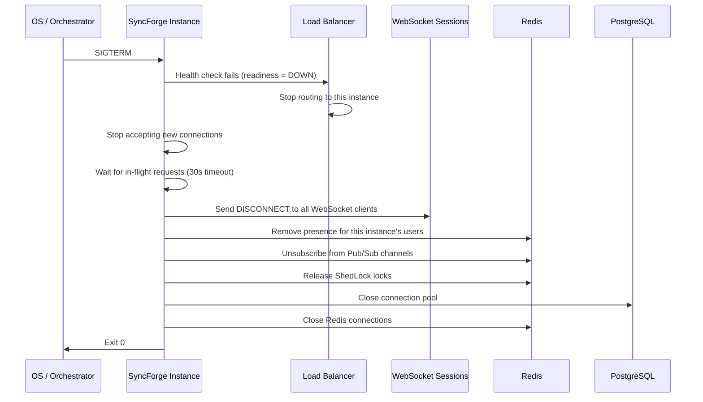

# SyncForge — Concurrency & Distributed Systems

## Concurrent Operation Analysis

### Task Updates (Highest Contention)

**Scenario**: Two users update the same task simultaneously.

| Property | Value |
|---|---|
| **Conflict detection** | Optimistic locking (`@Version`) |
| **Conflict response** | 409 Conflict to the second writer |
| **Retry behavior** | No automatic retry; user re-reads and re-applies changes |
| **UX** | Toast: "This task was modified. Please review the latest version." |
| **Frequency** | Low — typically 1-2 editors per task |

### Task Movement (Drag & Drop)

**Scenario**: Two users move different tasks within the same column simultaneously.

| Property | Value |
|---|---|
| **Conflict detection** | Fractional indexing — no conflict for different tasks |
| **Conflict response** | None needed — each task's position is independent |
| **Concurrent same-task move** | Optimistic locking on the task entity |
| **UX** | Optimistic UI — client updates immediately; server confirms or reverts |

**Scenario**: Two users move the same task simultaneously.

| Property | Value |
|---|---|
| **Conflict detection** | Optimistic locking on the task |
| **Conflict response** | Second move receives 409 Conflict |
| **Recovery** | WebSocket broadcasts the authoritative position to all clients |
| **UX** | Task snaps to server-authoritative position |

### Column Reordering

**Scenario**: Two users reorder columns simultaneously.

| Property | Value |
|---|---|
| **Conflict detection** | Fractional indexing — no conflict for different columns |
| **Concurrent same-column reorder** | Optimistic locking on the column entity |
| **UX** | Same as task movement |

### Comment Creation

**Scenario**: Two users comment on the same task simultaneously.

| Property | Value |
|---|---|
| **Conflict detection** | None needed — comments are append-only |
| **Conflict response** | Both comments are created independently |
| **Ordering** | `created_at` timestamp ordering |
| **UX** | Both comments appear in chronological order |

### Invitation Acceptance

**Scenario**: User clicks invitation link twice (double-click or page refresh).

| Property | Value |
|---|---|
| **Conflict detection** | Database: `UPDATE workspace_invitations SET status='ACCEPTED' WHERE token_hash=? AND status='PENDING'` — 0 rows on second attempt |
| **Conflict response** | 400 Bad Request: "Invitation already accepted" |
| **UX** | Redirect to workspace (idempotent from user's perspective) |

### Password Reset

**Scenario**: User submits password reset form twice.

| Property | Value |
|---|---|
| **Conflict detection** | Token status: `UPDATE password_reset_tokens SET status='USED' WHERE token_hash=? AND status='PENDING'` |
| **Conflict response** | 400 Bad Request on second attempt |
| **UX** | First submission succeeds; second shows "Token already used" |

### Refresh Token Rotation

**Scenario**: Two tabs simultaneously attempt refresh with the same token.

| Property | Value |
|---|---|
| **Conflict detection** | Database: `UPDATE refresh_tokens SET used=true WHERE token_hash=? AND used=false` — 0 rows on second attempt |
| **Conflict response** | Second tab: 401 Unauthorized |
| **Security**: If a used token is replayed, it indicates a potential attack — entire token family is revoked |
| **UX** | Second tab redirects to login |

### Presence Updates

**Scenario**: User has multiple tabs open; heartbeats from different tabs arrive simultaneously.

| Property | Value |
|---|---|
| **Conflict detection** | None needed — Redis SET is idempotent |
| **Resolution** | Last-write-wins — all heartbeats update the same Redis key |
| **UX** | No conflict visible — user appears online regardless of which tab heartbeats first |

### Notification Delivery

**Scenario**: Event produces notification while user is marking notifications as read.

| Property | Value |
|---|---|
| **Conflict detection** | None — independent operations |
| **Consistency** | New notification appears unread; read operations affect previously existing notifications |
| **Cache** | Unread count cache is invalidated on both create and read operations |

---

## Fractional Indexing — Implementation Detail

### Algorithm

Fractional indexing assigns lexicographically ordered string positions to items. Inserting between two items produces a new string that sorts between them without modifying other items.

### Position Generation

```java
public class FractionalIndex {

    private static final String ALPHABET = "0123456789ABCDEFGHIJKLMNOPQRSTUVWXYZabcdefghijklmnopqrstuvwxyz";

    /**
     * Generate a position string between two existing positions.
     * @param before Position before (null for start)
     * @param after Position after (null for end)
     * @return New position that sorts between before and after
     */
    public static String midpoint(String before, String after) {
        if (before == null) before = "";
        if (after == null) after = repeat(ALPHABET.charAt(ALPHABET.length() - 1), before.length() + 1);

        // Find first differing character position
        int commonLength = Math.min(before.length(), after.length());
        for (int i = 0; i < commonLength; i++) {
            int beforeIdx = ALPHABET.indexOf(before.charAt(i));
            int afterIdx = ALPHABET.indexOf(after.charAt(i));
            if (afterIdx - beforeIdx > 1) {
                // Gap exists — pick midpoint character
                return before.substring(0, i) + ALPHABET.charAt((beforeIdx + afterIdx) / 2);
            } else if (afterIdx - beforeIdx == 1) {
                // Adjacent — append midpoint to 'before' prefix
                return before.substring(0, i + 1) + midpoint("", after.substring(i + 1));
            }
        }
        // Extend with midpoint character
        return before + ALPHABET.charAt(ALPHABET.length() / 2);
    }

    /**
     * Generate initial positions for N items.
     */
    public static List<String> initialPositions(int count) {
        List<String> positions = new ArrayList<>();
        for (int i = 0; i < count; i++) {
            positions.add(String.valueOf(ALPHABET.charAt((i + 1) * (ALPHABET.length() / (count + 1)))));
        }
        return positions;
    }
}
```

### Default Column Positions

When a board is created with 3 default columns:
- "To Do": position = `"U"` (≈ 1/4 of alphabet)
- "In Progress": position = `"a"` (≈ 1/2 of alphabet)
- "Done": position = `"m"` (≈ 3/4 of alphabet)

### Rebalancing

If a position string exceeds 50 characters (indicating many insertions in the same gap), trigger a rebalancing operation:

1. Read all items in the column/board ordered by position
2. Reassign evenly spaced positions
3. Batch update in a single transaction
4. Broadcast updated positions via WebSocket

**Frequency**: Extremely rare. With a 62-character alphabet, it takes ~50 insertions in the exact same gap to reach 50 characters.

---

## Distributed System Readiness Validation

### WebSocket Subsystem

| Concern | Single Instance | Multi-Instance |
|---|---|---|
| Connection state | In-memory `SimpMessagingTemplate` | Same — connections are per-instance |
| Broadcasting | Local broadcast | Redis Pub/Sub relay — publish to `ws:board:{boardId}`, all instances receive and broadcast locally |
| User destinations | Local `/user/queue/notifications` | Redis Pub/Sub for user-targeted messages — publish to `ws:user:{userId}`, the instance holding the user's connection broadcasts |
| Subscription registry | In-memory | Each instance tracks its own subscriptions; no cross-instance registry needed |

### Presence Subsystem

| Concern | Single Instance | Multi-Instance |
|---|---|---|
| Heartbeat storage | Redis | Same — Redis is shared |
| User status | Redis HASH with TTL | Same |
| Workspace/board presence | Redis SET with TTL | Same |
| Disconnect handling | Instance detects disconnect, removes presence | Instance detects its own disconnects; other instances' users are unaffected |
| Server restart | All users on that instance go offline (TTL expires) | Only users on the restarting instance are affected; TTL ensures cleanup |

### Authentication Subsystem

| Concern | Single Instance | Multi-Instance |
|---|---|---|
| JWT validation | Stateless — any instance can validate | Same |
| JWT blacklist | Redis | Same — shared |
| Refresh tokens | PostgreSQL | Same — shared |
| Rate limiting | Redis | Same — shared |

### Caching Subsystem

| Concern | Single Instance | Multi-Instance |
|---|---|---|
| Cache storage | Redis | Same — shared |
| Invalidation | Delete key after write | Same — all instances see the invalidation on next read |
| Consistency | Eventually consistent (TTL-bounded) | Same |

### Scheduled Jobs

| Concern | Single Instance | Multi-Instance |
|---|---|---|
| Token cleanup | `@Scheduled` | ShedLock — only one instance executes |
| Notification cleanup | `@Scheduled` | ShedLock |
| Invitation expiration | `@Scheduled` | ShedLock |

**ShedLock implementation**: Use `shedlock-spring` + `shedlock-provider-redis` to ensure only one instance executes each scheduled job.

```java
@Scheduled(cron = "0 0 2 * * *")  // 2 AM daily
@SchedulerLock(name = "cleanupExpiredTokens", lockAtMostFor = "PT30M", lockAtLeastFor = "PT5M")
public void cleanupExpiredTokens() {
    refreshTokenRepository.deleteExpired();
    verificationTokenRepository.deleteExpired();
    passwordResetTokenRepository.deleteExpired();
}
```

---

## Idempotency

### Idempotent Operations

| Operation | Strategy |
|---|---|
| Task update (PUT/PATCH) | Optimistic locking — same version produces same result |
| Invitation acceptance | Token status check — `WHERE status='PENDING'` |
| Email verification | Token status check — `WHERE status='PENDING'` |
| Password reset | Token status check — `WHERE status='PENDING'` |
| Mark notification as read | `UPDATE ... SET read=true WHERE id=?` — idempotent |
| Heartbeat | Redis SET — idempotent |

### Non-Idempotent Operations

| Operation | Mitigation |
|---|---|
| Task creation | Client-generated request ID for duplicate detection (future enhancement). For MVP, duplicate creates are possible but harmless. |
| Comment creation | Same — duplicates possible but low-risk |
| Notification creation | Deduplication check: same type + reference + user within 1 minute |

---

## Failure Recovery

### Application Instance Crash

| Subsystem | Recovery |
|---|---|
| HTTP requests | Load balancer routes to healthy instances; client retries |
| WebSocket connections | Clients detect disconnect; auto-reconnect with exponential backoff; re-subscribe to channels |
| Presence | Redis TTL expires (60 seconds); users from crashed instance shown as offline |
| In-flight transactions | PostgreSQL rolls back uncommitted transactions |
| Domain events | After-commit events from the crashed instance are lost; this is acceptable — activity logs may miss entries, notifications may be missed (user can refresh) |
| Scheduled jobs | ShedLock releases lock after `lockAtMostFor`; another instance picks up |

### PostgreSQL Recovery

| Scenario | Recovery |
|---|---|
| Connection timeout | HikariCP retries; request gets 503 |
| Brief outage (< 30s) | HikariCP reconnects; transient 503 errors |
| Extended outage | Application health check fails; load balancer stops routing; alert fired |

### Redis Recovery

| Scenario | Recovery |
|---|---|
| Connection timeout | Lettuce auto-reconnects; cache misses fall through to DB |
| Brief outage (< 30s) | Graceful degradation; cache repopulates on reconnect |
| Extended outage | All Redis-dependent features degrade; application remains functional via DB fallback |
| Data loss (Redis restart) | All cache, presence, and rate limiting data lost; repopulates naturally via TTL-based cache miss → DB read → cache write |

---

## Health Checks

### Liveness Probe
```
GET /actuator/health/liveness
```
Returns 200 if the JVM is running. Does not check external dependencies.

### Readiness Probe
```
GET /actuator/health/readiness
```
Returns 200 if:
- PostgreSQL connection is healthy
- Redis connection is healthy
- Thread pool is not saturated

### Custom Health Indicators

```java
@Component
public class SyncForgeHealthIndicator implements HealthIndicator {

    @Override
    public Health health() {
        Map<String, Object> details = new HashMap<>();
        details.put("database", checkDatabase());
        details.put("redis", checkRedis());
        details.put("activeWebSockets", getActiveWebSocketCount());
        details.put("threadPoolUtilization", getThreadPoolUtilization());

        if (allHealthy(details)) {
            return Health.up().withDetails(details).build();
        }
        return Health.down().withDetails(details).build();
    }
}
```

---

## Graceful Shutdown

```yaml
server:
  shutdown: graceful
spring:
  lifecycle:
    timeout-per-shutdown-phase: 30s
```

### Shutdown Sequence


