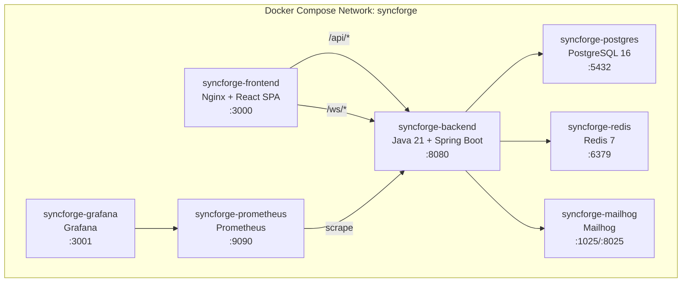

# SyncForge — Docker & Deployment

## Container Architecture



---

## Backend Dockerfile

```dockerfile
# Stage 1: Build
FROM eclipse-temurin:21-jdk-alpine AS build
WORKDIR /app
COPY pom.xml .
COPY .mvn .mvn
COPY mvnw .
RUN chmod +x mvnw && ./mvnw dependency:go-offline -B
COPY src src
RUN ./mvnw package -DskipTests -B

# Stage 2: Runtime
FROM eclipse-temurin:21-jre-alpine AS runtime
WORKDIR /app

RUN addgroup -S syncforge && adduser -S syncforge -G syncforge
USER syncforge

COPY --from=build /app/target/syncforge-*.jar app.jar

EXPOSE 8080

HEALTHCHECK --interval=30s --timeout=5s --start-period=60s --retries=3 \
    CMD wget -qO- http://localhost:8080/actuator/health/liveness || exit 1

ENTRYPOINT ["java", \
    "-XX:+UseContainerSupport", \
    "-XX:MaxRAMPercentage=75.0", \
    "-Djava.security.egd=file:/dev/./urandom", \
    "-jar", "app.jar"]
```

---

## Frontend Dockerfile

```dockerfile
# Stage 1: Build
FROM node:20-alpine AS build
WORKDIR /app
COPY package.json package-lock.json ./
RUN npm ci
COPY . .
RUN npm run build

# Stage 2: Serve
FROM nginx:alpine AS runtime
COPY --from=build /app/dist /usr/share/nginx/html
COPY nginx.conf /etc/nginx/conf.d/default.conf

EXPOSE 3000

HEALTHCHECK --interval=30s --timeout=5s --retries=3 \
    CMD wget -qO- http://localhost:3000/ || exit 1
```

### Nginx Configuration

```nginx
server {
    listen 3000;
    root /usr/share/nginx/html;
    index index.html;

    # SPA routing — all paths serve index.html
    location / {
        try_files $uri $uri/ /index.html;
    }

    # API proxy
    location /api/ {
        proxy_pass http://syncforge-backend:8080;
        proxy_set_header Host $host;
        proxy_set_header X-Real-IP $remote_addr;
        proxy_set_header X-Forwarded-For $proxy_add_x_forwarded_for;
        proxy_set_header X-Forwarded-Proto $scheme;
    }

    # WebSocket proxy
    location /ws/ {
        proxy_pass http://syncforge-backend:8080;
        proxy_http_version 1.1;
        proxy_set_header Upgrade $http_upgrade;
        proxy_set_header Connection "upgrade";
        proxy_set_header Host $host;
        proxy_read_timeout 86400s;
    }

    # Static asset caching
    location ~* \.(js|css|png|jpg|jpeg|gif|ico|svg|woff2)$ {
        expires 1y;
        add_header Cache-Control "public, immutable";
    }

    # Security headers
    add_header X-Frame-Options "DENY" always;
    add_header X-Content-Type-Options "nosniff" always;
    add_header Referrer-Policy "strict-origin-when-cross-origin" always;

    # Gzip
    gzip on;
    gzip_types text/plain text/css application/json application/javascript text/xml;
    gzip_min_length 256;
}
```

---

## Docker Compose

### Development Profile

```yaml
# docker-compose.yml
version: '3.8'
name: syncforge

services:
  backend:
    container_name: syncforge-backend
    build:
      context: ./backend
      dockerfile: Dockerfile
    ports:
      - "8080:8080"
    environment:
      - SPRING_PROFILES_ACTIVE=dev
      - SPRING_DATASOURCE_URL=jdbc:postgresql://postgres:5432/syncforge
      - SPRING_DATASOURCE_USERNAME=syncforge
      - SPRING_DATASOURCE_PASSWORD=syncforge_dev
      - SPRING_DATA_REDIS_HOST=redis
      - SPRING_DATA_REDIS_PORT=6379
      - SYNCFORGE_JWT_SECRET=dev-secret-key-minimum-32-characters-long-for-hs384
      - SYNCFORGE_MAIL_HOST=mailhog
      - SYNCFORGE_MAIL_PORT=1025
      - SYNCFORGE_CORS_ALLOWED_ORIGINS=http://localhost:3000,http://localhost:5173
    depends_on:
      postgres:
        condition: service_healthy
      redis:
        condition: service_healthy
    networks:
      - syncforge
    restart: unless-stopped

  frontend:
    container_name: syncforge-frontend
    build:
      context: ./frontend
      dockerfile: Dockerfile
    ports:
      - "3000:3000"
    depends_on:
      - backend
    networks:
      - syncforge
    restart: unless-stopped

  postgres:
    container_name: syncforge-postgres
    image: postgres:16-alpine
    ports:
      - "5432:5432"
    environment:
      - POSTGRES_DB=syncforge
      - POSTGRES_USER=syncforge
      - POSTGRES_PASSWORD=syncforge_dev
    volumes:
      - postgres_data:/var/lib/postgresql/data
    healthcheck:
      test: ["CMD-SHELL", "pg_isready -U syncforge -d syncforge"]
      interval: 10s
      timeout: 5s
      retries: 5
    networks:
      - syncforge

  redis:
    container_name: syncforge-redis
    image: redis:7-alpine
    ports:
      - "6379:6379"
    command: redis-server --maxmemory 64mb --maxmemory-policy allkeys-lru
    volumes:
      - redis_data:/data
    healthcheck:
      test: ["CMD", "redis-cli", "ping"]
      interval: 10s
      timeout: 5s
      retries: 5
    networks:
      - syncforge

  mailhog:
    container_name: syncforge-mailhog
    image: mailhog/mailhog:latest
    ports:
      - "1025:1025"   # SMTP
      - "8025:8025"   # Web UI
    networks:
      - syncforge

  prometheus:
    container_name: syncforge-prometheus
    image: prom/prometheus:latest
    ports:
      - "9090:9090"
    volumes:
      - ./docker/prometheus/prometheus.yml:/etc/prometheus/prometheus.yml
      - prometheus_data:/prometheus
    networks:
      - syncforge

  grafana:
    container_name: syncforge-grafana
    image: grafana/grafana:latest
    ports:
      - "3001:3000"
    environment:
      - GF_SECURITY_ADMIN_USER=admin
      - GF_SECURITY_ADMIN_PASSWORD=admin
    volumes:
      - grafana_data:/var/lib/grafana
      - ./docker/grafana/dashboards:/etc/grafana/provisioning/dashboards
      - ./docker/grafana/datasources:/etc/grafana/provisioning/datasources
    depends_on:
      - prometheus
    networks:
      - syncforge

volumes:
  postgres_data:
  redis_data:
  prometheus_data:
  grafana_data:

networks:
  syncforge:
    driver: bridge
```

### Development Shortcuts

```bash
# Start all services
docker compose up -d

# Start only infrastructure (DB, Redis, Mailhog)
docker compose up -d postgres redis mailhog

# View logs
docker compose logs -f backend

# Rebuild backend
docker compose up -d --build backend

# Reset database
docker compose down -v postgres && docker compose up -d postgres

# Full reset
docker compose down -v && docker compose up -d
```

---

## Environment Variables

| Variable | Required | Default | Description |
|---|---|---|---|
| `SPRING_PROFILES_ACTIVE` | Yes | — | `dev`, `test`, `prod` |
| `SPRING_DATASOURCE_URL` | Yes | — | PostgreSQL JDBC URL |
| `SPRING_DATASOURCE_USERNAME` | Yes | — | Database username |
| `SPRING_DATASOURCE_PASSWORD` | Yes | — | Database password |
| `SPRING_DATA_REDIS_HOST` | Yes | `localhost` | Redis host |
| `SPRING_DATA_REDIS_PORT` | Yes | `6379` | Redis port |
| `SYNCFORGE_JWT_SECRET` | Yes | — | JWT signing key (min 32 chars) |
| `SYNCFORGE_JWT_ACCESS_EXPIRY` | No | `900` | Access token lifetime (seconds) |
| `SYNCFORGE_JWT_REFRESH_EXPIRY` | No | `604800` | Refresh token lifetime (seconds) |
| `SYNCFORGE_MAIL_HOST` | Yes | — | SMTP host |
| `SYNCFORGE_MAIL_PORT` | Yes | — | SMTP port |
| `SYNCFORGE_MAIL_USERNAME` | No | — | SMTP username |
| `SYNCFORGE_MAIL_PASSWORD` | No | — | SMTP password |
| `SYNCFORGE_CORS_ALLOWED_ORIGINS` | Yes | — | Comma-separated allowed origins |
| `SYNCFORGE_BASE_URL` | No | `http://localhost:3000` | Base URL for email links |

### Spring Profiles

| Profile | Purpose |
|---|---|
| `dev` | Development: debug logging, Mailhog, seed data |
| `test` | Testing: Testcontainers, in-memory defaults |
| `prod` | Production: JSON logging, SMTP, strict security |

---

## Deployment Considerations

### Production Checklist

- [ ] Set `SPRING_PROFILES_ACTIVE=prod`
- [ ] Use strong `SYNCFORGE_JWT_SECRET` (generated, 64+ chars)
- [ ] Configure real SMTP credentials
- [ ] Set `SYNCFORGE_CORS_ALLOWED_ORIGINS` to production domain
- [ ] Enable HTTPS termination at load balancer
- [ ] Set PostgreSQL `max_connections` ≥ `instances × pool_size`
- [ ] Configure Redis `maxmemory-policy allkeys-lru`
- [ ] Disable actuator endpoints except `/health` and `/prometheus`
- [ ] Set up Prometheus scraping
- [ ] Configure Grafana alerts
- [ ] Set up log aggregation (ELK/Loki — future)
- [ ] Run Flyway migrations before deploying new version
- [ ] Verify health check passes before routing traffic
