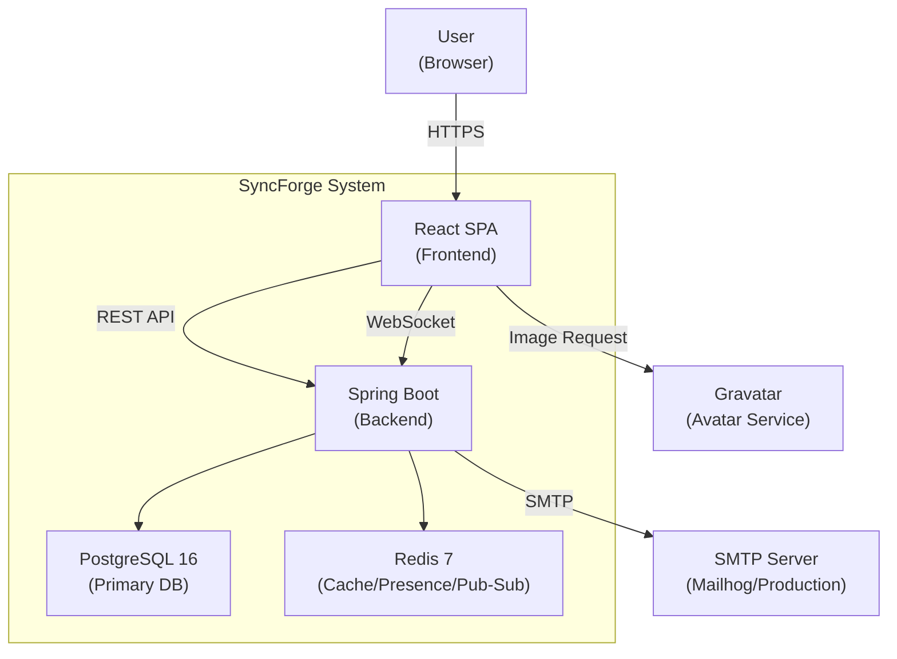
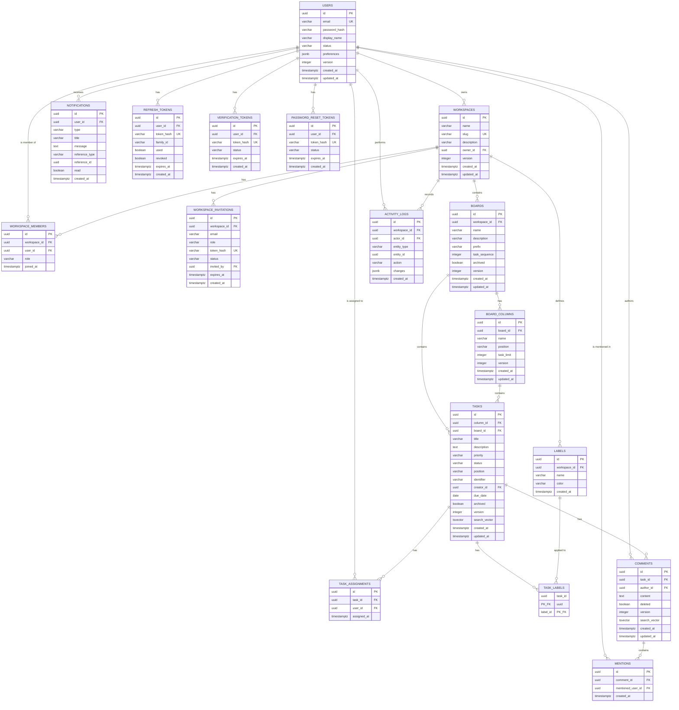
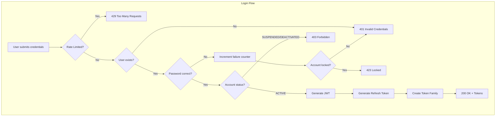
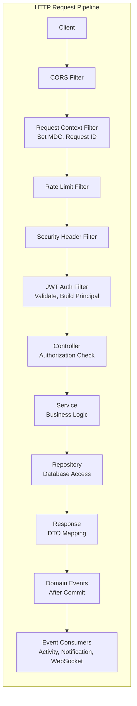
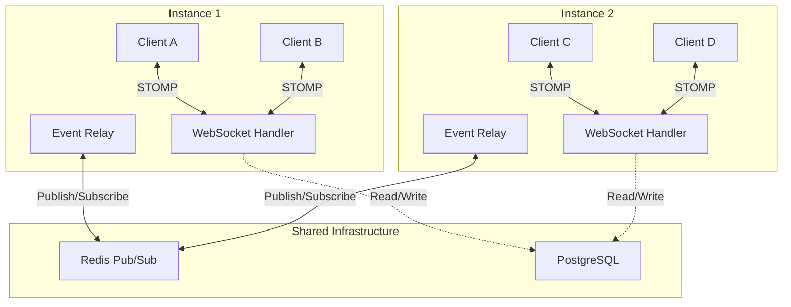
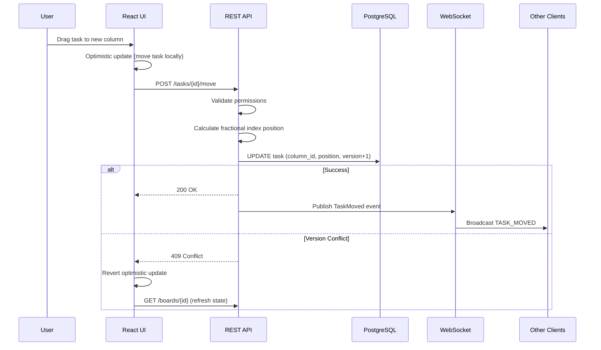
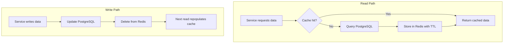
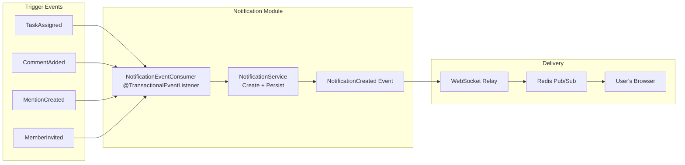
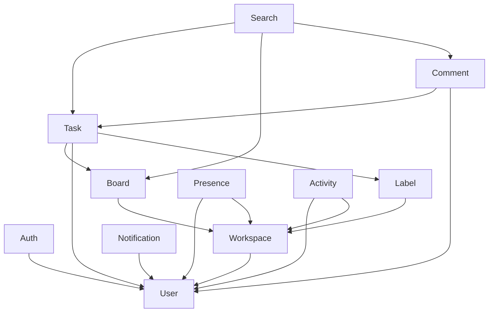
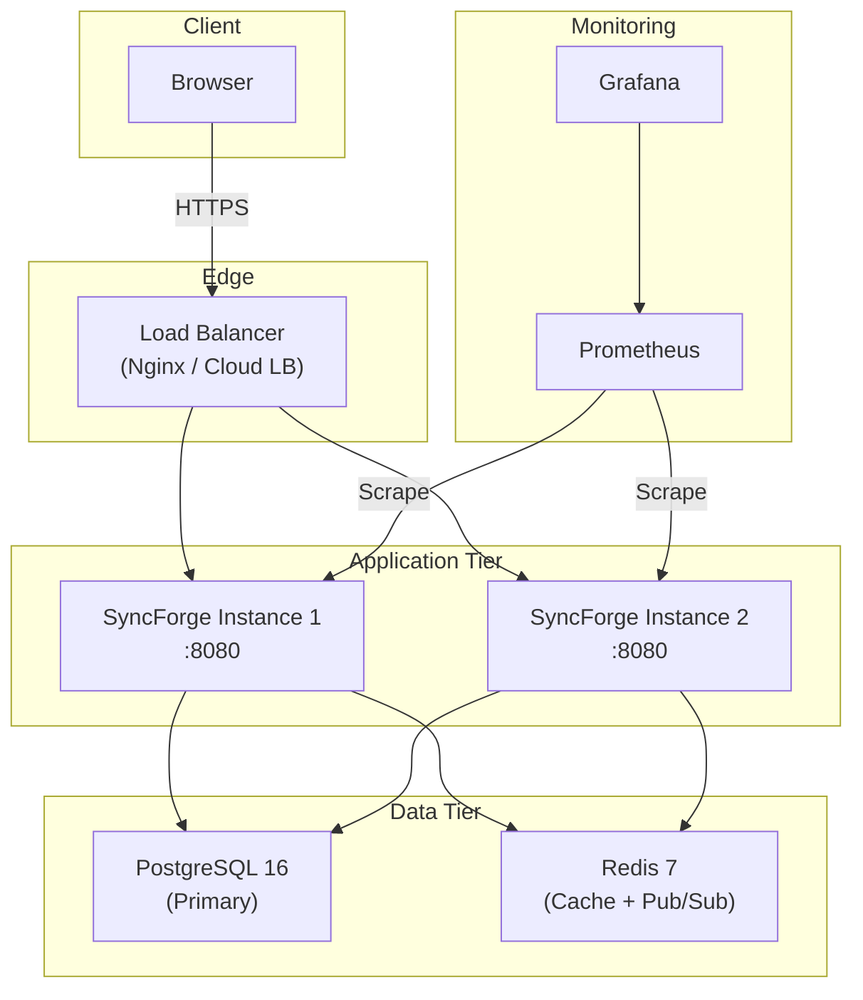

# SyncForge — Appendix: Diagrams

## System Context Diagram

---

## Full Entity Relationship Diagram

---

## Authentication Flow

---

## Request Lifecycle

---

## WebSocket Architecture

---

## Drag-and-Drop Flow

---

## Cache-Aside Pattern

---

## Notification Pipeline

---

## Domain Module Dependency Graph

**Rule**: Dependencies flow downward. No circular dependencies allowed.

---

## Deployment Architecture

